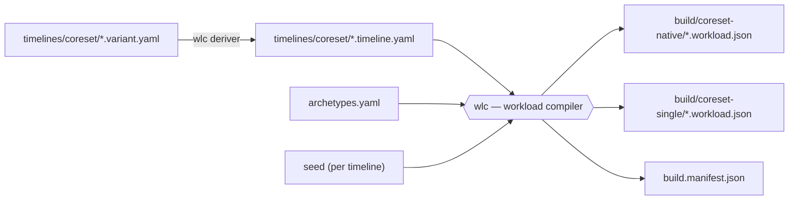

# dataset/

The **workload dataset**: everything that produces the canonical workload files the simulator and harness consume. Authored as human-readable **timelines**, compiled to machine-readable **canonical JSON** by **wlc** (the workload compiler, `tools/wlc/`) — wlc resolves all randomness at compile time, so the simulator replays concrete values and two conditions always face byte-identical workloads.

## Layout

```
archetypes.yaml        # behavior library — one entry per process kind (fully measured, v0.1)
sources.yaml           # machine registry of citation sources (subset of docs/references.md)
schema/
  workload.schema.json # canonical format, machine form — the simulator's loader contract
timelines/
  coreset/             # authored core set: *.timeline.yaml (novel) + *.variant.yaml (derivation recipes)
build/                 # compiled artifacts — NOT committed; verified via build.manifest.json
  coreset-native/      # 24 workloads, native lane counts
  coreset-single/      # same 24, lane-scaled to a single lane (experiments run on these)
build.manifest.json    # lockfile: input/output hashes of the last blessed build
coverage-grid.json     # mode × tier coverage grid over all segments (signed off)
meas/                  # meas-ci campaign outputs: analysis summary + verified name tables
tools/                 # all executable tooling (see below)
Makefile               # entry point for everything in this tree
```

## Pipeline



Same timeline + same library + same seed ⇒ byte-identical output. That determinism is load-bearing (experiment hygiene), which is why `build/` isn't committed: CI recompiles and diffs hashes against `build.manifest.json` instead.

## Workload Dataset

### Canonical format

One `*.workload.json` per workload, validated by `schema/workload.schema.json`, three top-level keys. All times are integer **microseconds**.

```jsonc
{
  "meta": {                     // provenance: what produced this file
    "id": "c2-p1a",
    "derived_from": "dataset/timelines/coreset/c2-p1a.timeline.yaml@2aa49c7…",
    "sampled": { "archetypes": "archetypes.yaml@99495a3…", "seed": 201 }
  },
  "ground_truth": [             // labeled segments — oracle + Layer-1 grader ONLY
    { "t_start": 0,        "t_end": 60000000,  "mode": "dev",      "attributes": { "wanted": true } },
    { "t_start": 60000000, "t_end": 180000000, "mode": "ml-train", "attributes": { "wanted": true } }
  ],
  "events": [                   // the workload itself — closed op set {arrive, wake}
    { "op": "arrive", "t": 0, "id": "editor", "name": "code", "depart": 180000000,
      "program": [ { "op": "WAIT", "channel": "input:editor" },
                   { "op": "RUN", "us": 23439 }, /* … */ ] },
    { "op": "wake", "t": 2098333, "channel": "input:editor", "target": "editor" }
  ]
}
```

- **`arrive`** brings a task into existence: its `name` (what the recognizer will see), its pre-sampled `program` over the six grammar primitives (RUN/SLEEP/TIMER/WAIT/WAKE/FORK+EXIT — every RUN duration already a concrete number), and its lifetime (`depart` for segment-bound tasks; finite tasks end when their program exits).
- **`wake`** delivers an exogenous stimulus on a channel (keystrokes, network replies…); a task blocked in `WAIT` on that channel becomes runnable. This is how "interactive" behavior exists without modeling a human.
- **`ground_truth`** never reaches the simulator's scheduler or any recognizer — information asymmetry is enforced by who gets handed which key.

Field semantics are normative in `docs/simulator/interpretation-contract.md`; the schema is the machine check, not the definition.

### Coresets

Two compiled variants of the same 24 workloads (~50 labeled segments total):

| Set | What it is | Use |
|---|---|---|
| `build/coreset-single/` | lane-scaled so total demand targets one CPU lane (~100–150%) | **all experiments run on these** |
| `build/coreset-native/` | native lane counts, no scaling | reference / sanity |

The 24 files come in six groups (design rationale: `docs/workload/building-plan.md`):

| Group | Files | The question it answers |
|---|---|---|
| **C1** calibration | 6 | Can a recognizer handle the *easy* case — one unmistakable situation per file (pure gaming, pure office, pure compile…)? This is the floor everything should pass, and the ground where a name whitelist looks perfect. |
| **C2** intent pairs | 6 (3 pairs) | When two workloads **behave identically** and differ only in intent — an ML training run vs. an indexer nobody asked for, a game download vs. a virus scan — can anything separate them? The two files in a pair differ in exactly one segment, so any difference in outcome is attributable to that one change. |
| **C3** transition arcs | 3 | When the situation *changes mid-run* (browsing → gaming → media over an evening), how quickly and correctly does recognition follow the change? |
| **C4** distractor injection | 3 | If an irrelevant process appears mid-situation (Discord pops up during a game, chrome opens during a compile), does the reading wrongly flip? Each file is a clone of a C1/C3 file plus one injected process, so it's measured against its own clean original. |
| **C5** familiarity ladder | 3 | Does recognition survive as process names get less recognizable — `firefox` → `soffice.bin` → `tracker-miner-fs-3` → invented names no software carries? Behavior is held identical across tiers; only the names change. A whitelist scores zero on the invented tiers by construction. |
| **C6** resolution limits | 3 | Where does name-based recognition break *by design*? A miner named `chrome`, a change happening inside one process (browser tab → video call), two equally-active foregrounds. These are known, pre-committed misses — shipped so the limits are measured, not just claimed. |

### Generalsets

*Not built yet.* The second timeline set, `generalset-{native,single}`: naturalistic workloads emitted by a generator rather than hand-authored, sharing the same compile path, linter, and provenance as the coresets. Lands with the naturalistic generator in a later phase (build-order step 7, `docs/workload/building-plan.md`).

## Commands

Needs Python 3.12+ with `pip install -r tools/requirements.txt` (PyYAML, jsonschema, pytest).

```
make dataset    # derive variants + grid, compile everything, refresh the manifest
make lint       # repo + timeline + canonical lints (no writes)
make test       # invariant test suite (pytest, tools/tests/)
make check      # what CI runs: derive --check + compile --check against the manifest
```

CI (`.github/workflows/dataset.yml`) runs `lint` / `test` / `check` on every PR and push to `main`. If you edit any timeline, variant file, or `archetypes.yaml`, run `make dataset` and commit the manifest change with it — otherwise `check` fails.

## Tools map

```
tools/compile.py       # CLI: timelines -> canonical (+ --check verify mode)
tools/derive.py        # CLI: variant recipes -> derived timelines + coverage grid (+ --check)
tools/lint.py          # CLI: all lints (+ --freeze for freeze-readiness)
tools/wlc/             # wlc, the workload compiler — the library behind those CLIs:
                       #   timeline.py / compiler.py  parse + compile
                       #   deriver.py                 variants: / inherit() / inject: sugar
                       #   sampling.py / units.py     seeded draws, integer-µs times
                       #   estimate.py                static per-file CPU-demand estimate
                       #   linter.py / grid.py        lint rules, coverage grid
tools/meas/            # meas-ci campaign tooling (samplers, analyzer, name verification)
tools/tests/           # invariant suite (47 tests) + fixtures
```

## Rules of the tree

- **Canonical semantics live in the docs, not here.** The compiler implements `docs/simulator/interpretation-contract.md`; the build order and set design follow `docs/workload/building-plan.md`; archetype authoring follows `docs/workload/archetype-plan.md`. When code and doc disagree, the doc wins — fix the code.
- **Behavior parameters live in `archetypes.yaml`, never inline in a timeline.** Timelines bind `(name, archetype)` and supply only the knobs listed in the archetype's `binding_params`.
- **Every parameter value is sourced.** Numbers carry a `source` tag resolving through `sources.yaml` → `docs/references.md`. Measured values are tagged `meas-ci:<workflow>:<run>`; raw data lives on the GitHub release named in the tag's registry entry.
- **Demand window.** Every compiled `-single` file must land in the ~100–150% window by the static estimate (`compile.py` prints per-file demand). Files outside it get redesigned, not waved through.
- **Zero `meas-pending`.** The library is fully measured; the linter keeps it that way.

## Where to go deeper

| Question | Doc |
|---|---|
| What do the canonical ops/fields *mean*? | `docs/simulator/interpretation-contract.md` |
| Why this set design, what are C1–C6? | `docs/workload/building-plan.md` |
| How is an archetype authored/measured? | `docs/workload/archetype-plan.md` |
| Where does a number come from? | `docs/references.md` + `sources.yaml` |
