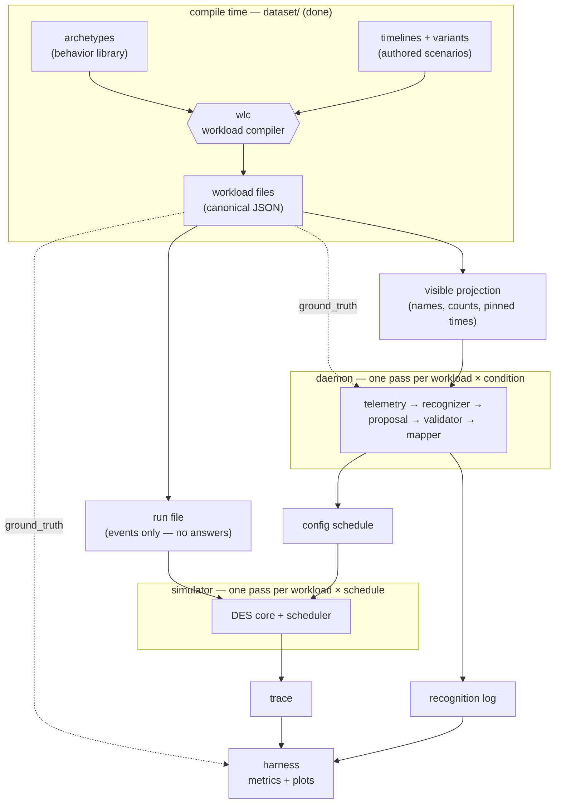

# Data Contracts — every format in the project, with examples
> Status: normative · Created 2026-08-28 · Updated 2026-09-08

Everything the three of us build talks to everything else through data — a file one side writes and another side reads. Each such format is a **contract**: as long as both sides honor it, we can work independently and integration stays boring. This document lists every contract in the project, shows what each one looks like with real (or, where not yet frozen, illustrative) examples, and explains every example in plain sentences. Same audience as `background-guide.md`: general CS knowledge is enough, no OS background needed.

Some contracts are **frozen** — by shipped files and enforcing code (archetype, timeline, workload), or by ratified decision (the `cpu_scheduler` config schema in `recognition-vocabulary.md`, and the trace). The protocol contracts froze on 2026-09-06 (§13). The proposal and the driver table's format froze on 2026-09-07. Every contract in this document is now frozen. Frozen is not untouchable: changing a frozen contract is always possible, it just takes everyone's sign-off plus a changelog entry — so propose edits rather than deviating quietly.

---

## 1. How everything connects

The single most important framing fact: **the simulator and the daemon never talk to each other at run time.** Both are offline programs that read files and write files. The daemon does all of its recognition work *before* any simulation happens, and hands the simulator a finished schedule of configurations. The whole experiment is a pipeline of files:



Read it as one piece of data's life story:

1. **Compile time** (already done, lives in `dataset/`): the **archetype** library says how each kind of process behaves, **timelines** say which processes are on stage when and what each moment truly means, and **wlc** — the workload compiler — combines them, rolls all the dice once, and writes **canonical workload files**. This half is finished and frozen; nobody re-runs it during experiments.
2. Each consumer's **own loader** extracts its permitted **view** of the workload file — the dataset tree ships only the raw canonical files and knows nothing about its consumers. The simulator's loader keeps the **run file** view (the events, stripped of the answer key) and discards everything else at the parse boundary; the daemon's loader keeps the **visible projection** view (just the process names, counts, and pinned lifetimes). The information asymmetry is enforced by each loader discarding what its program may not see — structurally, at the boundary, so nothing downstream could branch on it even by accident.
3. The **daemon** takes the visible projection and runs the whole recognition pipeline offline: it renders the projection into **telemetry** snapshots, feeds each one to a **recognizer** (the LLM, or the whitelist, or random — one per experimental condition; the oracle condition reads `ground_truth` instead of the projection), validates and clamps what comes back, maps it to scheduler settings, and writes two outputs: a **config schedule** (for the simulator) and a **recognition log** (for the grader).
4. The **simulator** takes the run file plus a config schedule and plays the workload out under it, writing a **trace** of everything that happened.
5. The **harness** reads traces and recognition logs after the fact and computes every metric and plot in the paper — comparing conditions, and comparing recognition logs against `ground_truth`.

The dotted lines are the deliberate cheat paths, and they are the experiment's core design: `ground_truth` reaches only the oracle recognizer and the grader. The simulator never sees it (the run file doesn't contain it); the LLM never sees it (the projection doesn't contain it).

| # | Contract | Shape | Producer → Consumer | Status |
|---|---|---|---|---|
| 1 | Archetype | YAML, `dataset/archetypes.yaml` | measurements/literature → wlc | **frozen** (v0.1) |
| 2 | Timeline (+ variant) | YAML, `dataset/timelines/` | human authors → wlc | **frozen** |
| 3 | Workload (canonical) | JSON, `dataset/build/`, schema `dataset/schema/workload.schema.json` | wlc → the two views, oracle, grader | **frozen** |
| 3a | Run file (view of 3) | extracted by the simulator's loader | workload file → simulator | **frozen** |
| 3b | Visible projection (view of 3) | extracted by the daemon's loader | workload file → daemon | **frozen** |
| 4 | Telemetry | JSON, internal to the daemon | daemon-internal (recorded in 6) | **frozen** |
| 5 | Proposal | JSON, internal to the daemon | daemon-internal (recorded in 6) | **frozen** |
| 6 | Config schedule | JSON | daemon → simulator | **frozen** |
| 7 | Recognition log | JSON | daemon → harness | **frozen** (envelope; the `proposal` slot follows contract 5) |
| 8 | Trace | JSONL, `*.trace.jsonl(.gz)` | simulator → harness | **frozen** |
| 9 | Driver table | YAML, `daemon/driver-table/{prior,calibrated}.yaml`, schema `daemon/driver-table/schema/driver-table.schema.json` | 인지오 → daemon (config mapper) | **frozen** (format; the prior table's content lands in Phase 6) |

---

## 2. Archetype — how one kind of process behaves

**Frozen (v0.1). File: `dataset/archetypes.yaml`. Read only by wlc, at compile time — the simulator never sees archetypes.**

An archetype is a reusable behavior template: "things of this kind use the CPU in this pattern." There are twelve (`audio-playback`, `video-playback`, `desktop-interactive`, `cpu-batch`, `compiler-child`, `build-orchestrator`, `io-stream`, `background-crawler`, `game-task-chain`, `network-bulk`, `electron-comms`, `system-daemon`). Every number in the library is either taken from published measurements or measured by us in CI, and each value records its source.

### Example A — the simplest one, `cpu-batch`

```yaml
cpu-batch:
  category_source: interbench
  pattern:
    program:
      - RUN: total_work
      - EXIT: {}
  params: {}
  lifetime: finite
  binding_params: [total_work]
```

In sentences: this archetype describes any process that simply computes until it is done — a training run, a virus scan in full swing, a renderer. Its behavior `program` is two steps: burn CPU for `total_work` amount of time, then exit. It carries no `params` of its own, because how *big* the job is depends on the scenario, not on the kind of process — so `total_work` is listed under `binding_params`, meaning "the timeline that uses me must supply this value." Its `lifetime: finite` says the process ends by finishing its work (whenever the scheduler lets that happen), rather than by the user closing it. `category_source: interbench` records where this behavior class comes from — the interbench benchmark's "Burn" load is the community's standard model of CPU saturation. (The real entry carries two more fields this excerpt trims: `validation_stats`, which says how the entry was checked, and `modeling_notes`, prose recording every modeling judgment — for instance, that the P1 experiment pair deliberately binds a file indexer's *full-rescan* state to `cpu-batch`.)

### Example B — a distribution-heavy one, `desktop-interactive` (abridged)

Before reading it, one convention that governs every number in the library: a parameter is never a bare value but a **distribution object** — `{dist, …parameters…, sampling, source}`. The `dist` field names the distribution family (`constant` for point values, `uniform`, `lognormal`, mixtures), the family's parameters follow, `sampling` says how often wlc draws from it (`per-instance`: once per task; `per-task`: one draw reused across iterations; `per-iteration`: a fresh draw every loop turn), and `source` names the citation or measurement the value stands on. Nothing in the library is an unsourced number.

```yaml
desktop-interactive:
  category_source: interbench
  pattern:
    program:
      - loop:
          - WAIT: input
          - RUN: burst
  params:
    input_gap:
      dist: lognormal-mixture
      fluent_mean_us: 158000        # ~158 ms between keystrokes while typing fluently
      pause_probability: 0.34       # about a third of gaps are think-pauses instead
      pause_mean_us: 395235
      sampling: per-iteration
      source: dhakal-chi18
    burst_fraction:
      dist: uniform
      min: 0.0
      max: 1.0
      sampling: per-iteration
      source: interbench:man-x
  lifetime: segment-bound
  binding_params: []
```

In sentences: this archetype describes an app a human is actively using — an editor, mostly. Its program is an endless loop of "wait for input, then do a short burst of work." Unlike `cpu-batch`, its `params` are **distributions, not constants**: `input_gap` says the time between one keystroke and the next is drawn from a two-component lognormal — fluent typing averages about 158 ms between keys, but with probability 0.34 the gap is a longer think-pause instead — and the `source` tags say exactly which paper or measurement each number comes from. `sampling: per-iteration` means wlc draws a *fresh* value for every loop turn (that's why a compiled editor program is hundreds of concrete numbers, no two alike). `lifetime: segment-bound` means this process ends when the "user" closes it — at a time pinned in the timeline — rather than by finishing. And note what an archetype *never* contains: a process name. `code`, `soffice.bin` and a fake name from the familiarity ladder can all bind to this same behavior; that separation of name from behavior is what several experiments are built on.

---

## 3. Timeline — who is on stage, when, and what it truly means

**Frozen. Files: `dataset/timelines/coreset/*.timeline.yaml` (scenarios) and `*.variant.yaml` (derivation recipes). Read only by wlc.**

A timeline is a hand-authored scenario script. Where an archetype says how one process *behaves*, a timeline says which processes *exist*, over what time span, and — crucially — what the machine is *really* being used for at each moment, which becomes the workload's hidden ground truth.

### Example A — a complete timeline, `c2-p1a` (this is the entire real file)

```yaml
meta:
  id: c2-p1a
  seed: 201

segments:
  - {from: 0s,  to: 60s,  mode: dev,      attributes: {background_wanted: true},
     scenario: [S11]}
  - {from: 60s, to: 180s, mode: ml-train, attributes: {background_wanted: true},
     scenario: [S11, S12]}

tasks:
  - {id: editor, name: code, archetype: desktop-interactive,
     arrive: 0s, depart: 180s}
  - {id: hog, name: python3, archetype: cpu-batch, arrive: 60s,
     bind: {total_work: 130s}}

focus:
  - {from: 2s, to: 178s, task: editor}
```

In sentences: this three-minute scenario is "a developer writing code, and at the one-minute mark they kick off an ML training run." The `segments` block is the ground-truth labeling: for the first 60 seconds the machine's situation is `dev` (development work); from 60 s to 180 s it is `ml-train`, and in both segments the background work is `wanted` — the user asked for it. (The `scenario` tags key each segment to the catalog of documented real-world co-occurrence patterns; they justify *why* this combination is realistic.) The `tasks` block puts two processes on stage: a task with internal id `editor`, wearing the process name `code`, behaving per the `desktop-interactive` archetype, present from 0 s until the user closes it at 180 s; and a task with id `hog`, named `python3`, behaving per `cpu-batch`, arriving at 60 s. Because `cpu-batch` demands a `total_work` binding, the timeline supplies it here: 130 seconds of CPU to chew through. The `focus` block says which task the (simulated) user's attention and input stream belong to. And `seed: 201` is the dice-roll recorded for reproducibility: compiling this file with this seed always yields the byte-identical workload.

One more timeline field worth knowing: **`count:`**. A task entry like `{id: renderers, name: chrome, archetype: electron-comms, count: 12}` (from the real `c1-browsing`) is multiplicity sugar — wlc expands it into 12 separate tasks (`renderers.1` … `renderers.12`), each with its own independently-sampled program, all wearing the name `chrome`. That is deliberate realism: a real process list during browsing shows a dozen identically-named Chrome processes, one per tab group.

### Example B — a variant recipe (an excerpt of the real `c2-pairs.variant.yaml`)

```yaml
variants:
  - id: c2-p1b
    from: c2-p1a.timeline.yaml
    ops:
      - rename: {from: python3, to: tracker-miner-fs-3}
      - patch-segment: {index: 1, mode: indexing,
                        attributes: {background_wanted: false}}
```

In sentences: many coreset files are deliberate near-copies of each other, and rather than maintaining two hand-written files that must stay identical except in one spot, we write the difference itself. This recipe says: take `c2-p1a` from Example A, rename the process `python3` to `tracker-miner-fs-3` (the GNOME file indexer), and re-label the second segment as `indexing` with `wanted: false`. Nothing else changes — same behavior, same seed, same timings, byte for byte. The result is the project's sharpest experimental pair: two workloads a scheduler cannot tell apart by any measurement, where the *right* treatment differs, and the only distinguishing information is the name. The derivation ops (`rename`, `patch-segment`, `patch-task`, …) are executed by wlc's deriver, and the derived timeline is regenerated and verified in CI, so the "identical except for exactly this" property is enforced by machinery rather than by care.

---

## 4. Workload (canonical) — the compiled master file, and its two views

**Frozen. Files: `dataset/build/coreset-{single,native}/*.workload.json`. Schema: `dataset/schema/workload.schema.json`. Produced by wlc.**

This is the file at the center of everything — everything soft in the two contracts above (distributions, archetype references, sugar) resolved to hard numbers. One file has three top-level keys, and *no experiment component reads the whole file*: each consumer gets a derived view containing only its slice.

### Example A — `meta` and `ground_truth` (real, from the compiled `c2-p1a`)

```jsonc
"meta": {
  "id": "c2-p1a",
  "derived_from": "dataset/timelines/coreset/c2-p1a.timeline.yaml@2aa49c7…",
  "sampled": { "seed": 201, "archetypes": "archetypes.yaml@99495a3…" }
},
"ground_truth": [
  { "t_start": 0,        "t_end": 60000000,  "mode": "dev",      "attributes": { "background_wanted": true } },
  { "t_start": 60000000, "t_end": 180000000, "mode": "ml-train", "attributes": { "background_wanted": true } }
]
```

In sentences: `meta` is pure provenance — which timeline at which git commit produced this file, sampled from which library commit with which seed — so any number anywhere in the file can be traced to its origin. `ground_truth` is the timeline's `segments` block carried through compilation: the same two labeled intervals, now in integer **microseconds** (60000000 µs = 60 s — all times in this format are integer microseconds, everywhere). This is the answer key: only the oracle recognizer and the accuracy grader may read it. A segment may also carry `familiarity` (integer 1–5, the tier of its process names as defined in `workload/building-plan.md` C5), present exactly when the timeline authored it — today the three C5 files — and never derived; it is the grader's split key for reporting recognition accuracy by familiarity tier, and no recognizer ever sees it.

### Example B — three `arrive` events showing the three kinds of task

```jsonc
// (1) An interactive, segment-bound task — the editor. Its program is a long
//     flat list of concrete numbers; every value was drawn at compile time.
{ "op": "arrive", "t": 0, "id": "editor", "name": "code", "depart": 180000000,
  "program": [
    { "op": "WAIT", "channel": "input:editor" },
    { "op": "RUN",  "us": 23439 },
    { "op": "WAIT", "channel": "input:editor" },
    { "op": "RUN",  "us": 253642 }
    // …hundreds more pairs, all different
  ] }

// (2) A periodic task — a game's frame producer (from c1-gaming).
{ "op": "arrive", "t": 0, "id": "game.chain.1", "name": "game.exe", "depart": 60000000,
  "program": [
    { "op": "LOOP", "count": "unbounded", "body": [
        { "op": "TIMER", "period_us": 16667 },
        { "op": "RUN",   "us": 646 },
        { "op": "WAKE",  "target": "game.chain.2" }
    ] }
  ] }

// (3) An orchestrator — `make` driving 100 compiler children (from c1-compile).
{ "op": "arrive", "t": 2000000, "id": "build", "name": "make", "fork_cap": 8,
  "program": [ { "op": "RUN", "us": 105 }, { "op": "FORK" },
               { "op": "RUN", "us": 653 }, { "op": "FORK" } /* …98 more… */ ],
  "spawn_table": [
    { "id": "build.c1", "name": "cc1",
      "program": [ { "op": "RUN", "us": 664 }, { "op": "SLEEP", "us": 3126 },
                   { "op": "RUN", "us": 9 }, { "op": "EXIT" } ] }
    // …one fully-written entry per child, 100 in total
  ] }
```

In sentences, one per task: **(1)** the editor arrives at time zero and will be forcibly removed at exactly t = 180 s (`depart` present = segment-bound — the "user" closes it). Its program alternates "wait for a keystroke on my input channel" with "compute for exactly this many microseconds" — 23,439 µs, then 253,642 µs, and so on; the variety that was a distribution in the archetype is now literal numbers. **(2)** the frame producer runs a compact endless loop: wait for the next tick of a 16,667 µs metronome (that's 60 frames per second), do 646 µs of frame work, then wake the next stage of the frame pipeline — sixteen tasks pass each frame down a bucket brigade this way, and the compiled `c1-gaming` contains **300 tasks named `game.exe`** (the chain plus hundreds of small helpers the constructor expands). The metronome ticks on a fixed grid, so a late frame doesn't push the schedule later; missed ticks pile up as backlog. **(3)** `make` arrives at t = 2 s carrying a `spawn_table`: a pre-written list of 100 compiler children, each with its own complete program already sampled. Each `FORK` in make's program launches the next child from the table, but never more than `fork_cap: 8` alive at once — exactly `make -j8`. Which children exist is fixed in the file; *when* each one gets to start depends on how the scheduler treats the family. Note also (3) has no `depart` and its children end in `EXIT`: those are the other two lifetime classes, finite and spawned.

### Example C — a `wake` event (the other, and only other, event kind)

```jsonc
{ "op": "wake", "t": 2098333, "channel": "input:editor", "target": "editor" }
```

In sentences: at exactly t = 2.098333 s, a keystroke arrives for the editor. If the editor is currently blocked in a `WAIT` on channel `input:editor`, it becomes runnable and its next `RUN` burst begins competing for CPU. A workload file contains hundreds of these — they are the pre-sampled trace of the simulated human's hands, pinned to absolute times so that every experimental condition faces the identical user.

### The two derived views

**Frozen 2026-09-06. These views are not files the dataset ships — each consumer's own loader extracts its view from `*.workload.json` and discards the rest at the parse boundary. The dataset tree stays consumer-agnostic: it provides the raw canonical files and nothing else.**

**Run file** (`simulator` input): the workload minus everything the simulator must not see — `ground_truth` gone, `meta` reduced to the id. Structurally it is just the `events` list:

```jsonc
{ "workload_id": "c2-p1a",
  "events": [ /* exactly the arrive and wake events of Example B and C */ ] }
```

**Visible projection** (`daemon` input): what a recognizer is entitled to know — names, counts, and *pinned* lifetime times only. No programs, no burst durations, no labels. From `c1-compile`:

```jsonc
{ "workload_id": "c1-compile",
  "tasks": [
    { "name": "code", "t_arrive": 0, "t_depart": 60000000 },
    { "name": "make", "t_arrive": 2000000,
      "children": [ { "name": "cc1", "count": 100 } ] }
  ] }
```

In sentences: the projection says a process named `code` exists from 0 to 60 s (its depart is pinned, so the projection may know it), and a process named `make` appears at 2 s with no known end (it's finite — when it ends is a scheduling outcome, so the projection *cannot* contain it). The `children` entry handles spawn tables: *which* children `make` will create is compile-time knowledge — a hundred processes named `cc1` — so they are visible, attributed to their parent's lifetime; *when* each individually starts and stops is emergent and therefore absent. This is what lets a recognizer see the `{code, make, cc1×100}` swarm that reads as "compile," without leaking any behavioral ground truth. Top-level tasks are **one entry per canonical task instance, never folded**: `c1-browsing`'s 13 `chrome` tasks are 13 entries with their own pinned times, and it is the telemetry builder that aggregates them into `chrome × 13`. Only `children` carry a `count`, because a spawn table's children have no pinned times of their own.

---

## 5. Telemetry — what the recognizer is shown

**Frozen 2026-09-06. Telemetry never crosses a tree boundary as a file of its own — it is built inside the daemon from the visible projection, and each snapshot is preserved verbatim inside the recognition log. It still gets its own section, because it is the shape the daemon's internals — and the LLM prompt — are built around.**

```jsonc
// t = 0: the editor arrives — the first set change, and the first snapshot
{ "t_us": 0, "processes": [ { "name": "code", "count": 1 } ] }

// at the 60-second mark the training run arrives — the set changed
{ "t_us": 60000000, "processes": [ { "name": "code",    "count": 1 },
                                   { "name": "python3", "count": 1 } ] }
```

In sentences: the daemon walks the visible projection's pinned events (arrivals and pinned departs) in time order and maintains the set of live process names with counts; each change of that set is one telemetry snapshot, and each snapshot is one query point. The transition between the two snapshots above is the moment the whole system turns on: the set changed, so the recognizer is consulted. During the 60 stable seconds between them, *nothing* is queried — an unchanged set means an unchanged answer, and re-asking would produce identical responses for nothing. Five rules fix what "the set changed" means, so two builders emit the same snapshots: **(1)** the set is the name→count multiset, so a count-only change (a 14th `chrome`, another download worker) is a change and emits a snapshot — `c6-spoof` depends on this, since its spoofing `chrome` arrives among 13 existing ones; **(2)** all pinned events at one timestamp are applied first and produce exactly one snapshot; **(3)** `processes` is sorted by name, so reruns are byte-identical; **(4)** the snapshot at the workload's final instant — every coreset file has one, because segment-bound tasks depart at the end — is emitted and logged like any other, because the projection carries no duration and the daemon cannot know it is the end; the schedule entry it produces lands at or after the end, where the simulator has nothing left to apply it to and the grader no segment to grade it against; **(5)** nothing else emits a snapshot — no timers, no periodic re-asks. Names arrive with counts (`chrome × 13`, `game.exe × 300`, `cc1 × 100`) because the count is itself signal: thirteen chromes read as a browser with tabs; a hundred `cc1` read as a parallel build. What telemetry deliberately **excludes** defines the experiment: no PIDs, no CPU or burst statistics (that is the hidden behavioral ground truth being tested against), no mode labels (that is the answer), and no command lines (canonical files carry names only — a frozen dataset decision). Two consequences of the pinned-events-only rule, stated honestly: the recognizer reacts to *launches* and *user-closes*, never to background jobs finishing (a finite task that exits never disappears from telemetry), and spawn children appear when their parent does. When results look ambiguous there will be a temptation to "just give the model a bit more context"; the frozen telemetry shape is what makes that a visible protocol change rather than a quiet experiment-invalidating tweak.

## 6. Proposal — what the recognizer answers

**Frozen 2026-09-07, together with the driver table (§10). Like telemetry, the proposal is internal to the daemon — the recognizer's raw answer before validation, preserved verbatim inside the recognition log.**

```jsonc
{
  "reasoning": "code is a programmer's editor and is the focus of input. python3 arriving
                and computing steadily beside it is most plausibly a training or data job
                the developer started deliberately, so it is wanted background work —
                it should be throttled below the editor, not deferred outright.",

  "situation": "Development with a user-initiated training run",

  "system": {
    "mode": "ml-train",
    "background_wanted": true
  },

  "subsystems": {
    "cpu_scheduler": {
      "algorithm": "MLFQ",
      "params": { "num_queues": 3, "timeslice_us": 2000, "timeslice_growth": 2, "boost_interval_us": 100000 },
      "batch_bandwidth_cap": 0.15
    }
  }
}
```

In sentences: the proposal has four parts with sharply different fates. `reasoning` is mandatory prose — the model must explain its reading *before* concluding; it flows to the recognition log only. `situation` is a one-line human summary, same destination. `system` is the heart of the contract: the machine-readable claim about the world, in the closed shared vocabulary fixed by `recognition-vocabulary.md` — exactly one `mode` from the 16-entry menu plus the boolean `background_wanted`. It is subsystem-neutral: a power-management driver could act on this very same block. `subsystems` is a namespace of per-consumer suggestions — this project only ever fills `cpu_scheduler` — and it is the *least* trusted part: depending on the condition it is ignored entirely (`llm_vocab` and every non-LLM condition: only `system` is used, and the driver table picks the configuration), consulted for the algorithm choice only (`llm_algo`), or taken in full (`llm_full`). **The read scope is applied before validation, and the validator's five rules run on the composed configuration — the thing the simulator will receive — not on the raw block.** Under `llm_algo` the block is `{ "algorithm": … }`; any other field in it is unread and stays in the log. Only under `llm_full` is the raw block itself what gets validated. Without this rule an `llm_algo` answer carrying only `algorithm` would fail rule 2 (exact `params`) whenever it disagreed with the row — the one case in which the condition differs from `llm_vocab` at all. The model may never invent vocabulary: an unknown mode, attribute, or subsystem key is rejected by the validator, full stop.

---

## 7. Config schedule — what the daemon hands the simulator

**Frozen 2026-09-06 — the first of the protocol contracts to freeze, since both sides build against it. Flows daemon → simulator, one file per workload × condition.**

```jsonc
{
  "workload_id": "c2-p1a",
  "condition": "llm_vocab",                     // who produced this schedule
  "schedule": [
    { "t_us": 0,                                // every schedule starts at t=0
      "config": { "algorithm": "MLFQ",
                  "params": { "num_queues": 3, "timeslice_us": 2000,
                              "timeslice_growth": 2, "boost_interval_us": 100000 },
                  "batch_bandwidth_cap": null },
      "provenance": "fallback" },               // boot default — no recognition yet

    { "t_us": 60450000,                         // set changed at 60 s + 450 ms latency
      "config": { "algorithm": "MLFQ",
                  "params": { "num_queues": 3, "timeslice_us": 2000,
                              "timeslice_growth": 2, "boost_interval_us": 100000 },
                  "batch_bandwidth_cap": 0.15 },
      "provenance": "unmodified" }
  ]
}
```

In sentences: a config schedule is a small, finished list of "at virtual time T, the scheduler's settings become C." The simulator applies each entry at its time as just another event — it neither knows nor cares whether the schedule came from an LLM, a whitelist, a random draw, or the oracle; that ignorance is what makes conditions comparable. The first entry is always at t = 0 and is the boot default (plain MLFQ), because recognition hasn't seen anything yet. The second entry is the daemon's reaction to the training run appearing at 60 s — note its timestamp is 60 s *plus 450 ms*: the daemon stamps configs late by its measured recognition latency, which is how LLM slowness remains an honest, measured part of the experiment even though inference ran offline. (The oracle daemon stamps exactly 60000000 — perfect recognition has zero delay; the `fixed` condition emits a one-entry schedule and never changes.) The `config` payload is algorithm-dependent — an EDF entry would carry `{ "algorithm": "EDF", "params": { "residual_timeslice_us": 2000 }, "batch_bandwidth_cap": 0.12 }`, a lottery entry its `batch_share`. The full field lists, ranges, and defaults for all four algorithms are frozen in `recognition-vocabulary.md` (the config schema section) — and each entry carries its `provenance`: `unmodified` (proposal applied as-is), `clamped` (pulled into legal bounds), `held` (proposal rejected; previous config carried forward), or `fallback` (the default, from boot or after repeated failures). Every performance figure in the paper is reported next to the provenance breakdown of the schedule that produced it, because a condition that scored well while mostly running fallback demonstrated nothing about recognition. For that breakdown to be computable from the schedule alone, **every query point yields exactly one schedule entry**: a rejected proposal still produces an entry, repeating the configuration in force with provenance `held`, stamped at the query point plus that recognition's latency. Entries are never elided because the config did not change (the `fixed` condition consults no recognizer, so its schedule stays one entry). Four more rules fix the mechanics so both builders read one file the same way. **Order:** the boot entry is always first; the rest are sorted by `t_us`, ties broken by emission order; the simulator applies same-time entries in list order and the last one applied is in force — this matters at t = 0, where zero-latency conditions (`oracle`, `random`) stamp their first answer at the same instant as the boot entry. Sorting also means a slow answer to an older snapshot can land after, and overwrite, the answer to a newer one; the schedule records exactly that, and any policy for stale answers (skipping a query whose snapshot has since been superseded) is the daemon's, visible in the recognition log, not something this format expresses. **Payload:** `config` is the post-validation configuration actually in force after the entry — clamped values for `clamped`, the carried-forward config for `held`; the raw proposal lives only in the recognition log. **Validity:** every `config` is valid under the frozen schema in `recognition-vocabulary.md`; the simulator rejects the whole file on a violation rather than repairing or skipping an entry, because a malformed entry is a daemon bug and silent repair would hide it from every provenance count. **End:** entries at or after the workload's end (the terminal snapshot's, telemetry rule 4) are ignored by the simulator.

---

## 8. Recognition log — what the daemon hands the grader

**Frozen 2026-09-06 — the envelope. The `proposal` object inside each entry is contract 5 and follows its freeze. Flows daemon → harness, one file per workload × condition. The config schedule is what recognition *decided*; this is the record of what it *thought*.**

```jsonc
{
  "workload_id": "c2-p1a",
  "condition": "llm_vocab",
  "seed": null,                                 // the PRNG seed for `random`; null otherwise
  "queries": [
    { "t_set_change": 60000000,                 // = the snapshot's t_us
      "telemetry": { "t_us": 60000000,
                     "processes": [ { "name": "code",    "count": 1 },
                                    { "name": "python3", "count": 1 } ] },
      "proposal": {
        "reasoning": "code is an editor in active use. python3 alongside an editor at
                      sustained CPU most plausibly reads as a training or data job the
                      developer just started; work the user initiated should keep
                      progressing in the background.",
        "situation": "Development with a user-initiated training run",
        "system": { "mode": "ml-train", "background_wanted": true }
      },
      "validation": "unmodified",
      "latency_us": 450000
      // optional: "raw": "<verbatim model text>" when the answer could not be parsed
      //           (then "proposal" is null and "validation" is "held");
      //           "source": { … } — per-condition audit detail, ignored by the grader
      //           (oracle: the ground-truth segment it read; random: its draw;
      //            whitelist: the rule that matched)
    }
  ]
}
```

In sentences: one entry per **query point** — each pinned set change that made the daemon consult its recognizer. The entry records the exact telemetry snapshot the recognizer was shown (so grading is self-contained and auditable), the full proposal that came back, what the validator did with it, and how long recognition took. Layer-1 metrics — mode accuracy, per-attribute accuracy, the confusion matrix, consistency across repeated runs, accuracy split by software familiarity — are all computed by comparing these entries against `ground_truth`, with no simulator involved at all. The `reasoning` field is never scored automatically; it is read by humans during failure analysis, because it distinguishes "the model didn't know what the software was" (a knowledge limit) from "it knew and drew the wrong conclusion" (a fixable prompt or mapping problem). For non-LLM conditions the log still exists but is thinner — the whitelist logs which rule matched; the oracle logs the ground-truth row it read; `random` logs its draw — so every condition's decisions are auditable in the same place. The shape of that thinner entry is fixed, not left to each builder: **every condition fills `proposal.system` the same way** (it is what the validator consumes); `reasoning` and `situation` may be absent for non-LLM conditions; the per-condition detail goes in the optional `source` object, which the grader ignores; `random`'s seed is the top-level `seed`. When the model's answer cannot be parsed, `proposal` is `null`, `validation` is `held`, and the optional `raw` string keeps the verbatim text — the log never loses what was said. **`validation` mirrors the schedule:** one query produces one schedule entry (§7), so the log's `validation` sequence equals the schedule's `provenance` sequence minus the boot entry, over the same four values — a consistency check the harness guards run for free. **Grading scope:** an entry is graded only if a non-`ambiguous` ground-truth segment covers its `t_set_change`; the terminal snapshot (telemetry rule 4) has no covering segment and is skipped, and `ambiguous` segments are excluded by `recognition-vocabulary.md` §1. **Latency:** non-LLM conditions record 0; LLM conditions in replay mode record the latency measured at record time (daemon-guide §7), never the replay's. `t_set_change` is the embedded snapshot's `t_us`.

---

## 9. Trace — what happened, written down

**Frozen 2026-08-28. Flows simulator → harness — the simulator's only real product: an append-only log of everything that happened, from which the harness computes every metric after the fact; the simulator itself computes no statistics.** (As with every frozen contract: not untouchable — if implementing it surfaces something awkward, propose the change rather than deviating quietly.)

The format is **JSONL** — one JSON object per line, lines ordered by `t`, ties resolved by the simulator's deterministic tie-break rule. All times integer microseconds. Traces may be gzipped on disk (`*.trace.jsonl.gz`); the harness streams either. Same workload events + same config schedule ⇒ byte-identical trace — this doubles as the reproducibility test and the golden-trace regression net.

The first line is a header identifying the run:

```jsonc
{"event":"meta", "workload_id":"c1-office", "condition":"fixed",
 "sim":"simulator@<version-or-commit>", "schedule_entries":1}
```

Then **seven runtime event types**, and nothing else the harness reads:

```jsonc
// task lifecycle — arrivals included even though file tasks' arrivals are in the
// input, because spawned children's start times are EMERGENT and belong here:
{"event":"task_arrive", "t":2000000, "task":"build",    "source":"file"}
{"event":"task_arrive", "t":2000105, "task":"build.c1", "source":"spawn", "parent":"build"}
{"event":"task_end",    "t":2158000, "task":"build.c1", "reason":"exit"}      // or "depart"

// readiness — the moment a task becomes runnable, with why:
{"event":"ready", "t":10000, "task":"editor", "cause":"wake"}
//   cause ∈ arrive | wake | sleep_end | timer_tick | fork_slot

// lane occupancy — who held the CPU, from when to when, and why it ended:
{"event":"run_start", "t":20000, "task":"editor"}
{"event":"run_end",   "t":23000, "task":"editor", "reason":"block", "blocked_on":"wait"}
//   reason ∈ block | preempt | exit | depart;  blocked_on ∈ wait | sleep | timer | fork_slot

// one line per periodic job:
{"event":"deadline", "t":15625, "task":"game.chain.16", "due":16667, "met":true, "slack_us":1042}

// each config-schedule entry taking effect:
{"event":"config_applied", "t":60450000, "index":1, "algorithm":"MLFQ", "provenance":"unmodified"}
```

Why `ready` is its own event — the one non-obvious call: for interactive work, the number that matters is *per-stimulus* scheduling delay, keystroke → service, which is `run_start − ready`. The harness cannot reconstruct readiness from the input file, because it is emergent: a keystroke queued while the task is mid-burst makes the task runnable at a different moment than the wake event's timestamp, and `sleep_end`/`timer_tick`/`fork_slot` readiness times all depend on scheduling. Emitting readiness explicitly means the harness never re-implements simulator semantics — the class of bug that produces silently wrong papers. The same logic puts spawned children's `task_arrive` in the trace: fork times are emergent, and "how fast did the build fan out" reads straight off it.

How every metric maps:

| Metric | Computed from |
|---|---|
| Response time (per task) | first `run_start` − `task_arrive` |
| Interaction latency (per stimulus) | `run_start` − matching `ready(cause=wake)` |
| Turnaround | `task_end` − `task_arrive` |
| Throughput | Σ run intervals of batch tasks / elapsed |
| Starvation | longest gap where a task has `ready` but no `run_start` |
| Deadline miss rate / P99 frame latency | `deadline` lines (`met`, `slack_us`) |
| Context-switch count | `run_end(reason=preempt)` count |
| Provenance breakdown / config age | `config_applied` lines joined with occupancy |
| Utilization / idle | complement of run intervals |

Two rules complete the contract. **The harness set is closed**: the eight event types above are what the harness reads — but anything the simulator wants to emit for its own debugging is welcome under an `x_`-prefixed event name (`{"event":"x_mlfq_boost", …}`); the harness ignores the prefix wholesale, so diagnostics need no schema negotiation. And **two definitions ride with the metric-definitions freeze**, not with this format: what "a periodic job completes" means (working definition: job k starts when its TIMER tick is consumed and completes when the task next reaches a TIMER; `due` = tick k + period — the `deadline` line's shape is unaffected if this is adjusted, but the numbers move), and that starvation is measured from `ready`, never from arrival (a task sleeping voluntarily is not starving).

---

## 10. Driver table — what the mapper looks up

**Frozen 2026-09-07 (the format). Files: `daemon/driver-table/prior.yaml` and `calibrated.yaml`; schema `daemon/driver-table/schema/driver-table.schema.json`; lint `daemon/tools/lint.py` (CI: `daemon` workflow). Authored by 인지오; read by the daemon's config mapper. The prior table's content is Phase 6.**

The table turns an accepted situation reading into a scheduler configuration. It is keyed by `(mode, background_wanted)` — 32 rows, every combination present. One row, from a prior table (values illustrative):

```yaml
role: prior                       # prior | calibrated
rows:
  - mode: ml-train
    background_wanted: true
    batch_bandwidth_cap: 0.30     # per row — the attribute's decision, shared by every entry
    default: MLFQ                 # what every system-only condition receives
    justification: "A training run the user started should progress but never take the editor's slice."
    entries:                      # one to four, one per algorithm
      MLFQ:
        params: { num_queues: 3, timeslice_us: 2000, timeslice_growth: 2, boost_interval_us: 100000 }
        basis: theory             # theory | schema-default | tuned
        justification: "Interactive editor plus one CPU-bound job is MLFQ's home case."
```

In sentences: a row says what the situation *wants* (the cap) and what the driver *does on its own* (the default), and then lists what each algorithm would be configured as in that situation. Which entry a condition receives depends only on how much of the recognizer's answer the condition reads: `random`, `whitelist`, `llm_vocab`, and `oracle` read `system` only and receive the row's **default** entry — the invariant that makes the executor byte-identical across those conditions at the table as well as in the simulator. `llm_algo` additionally reads the algorithm the model named and receives **that algorithm's entry** from the same row; if the row has no such entry, the mapper composes one from the config schema's defaults for that algorithm with the row's cap, bounding as it composes — LOTTERY's `batch_share` becomes `min(schema default, cap)` — so the composed configuration is legal as built and the schedule entry is `unmodified` (the model proposed nothing about the share, so `clamped` would misattribute mapper arithmetic to the recognizer). Nothing is rejected on this path, and on the calibrated table, which the lint requires to be full, it is never taken; it exists for the deferred vocabulary-gap arm. The composed configuration — `{algorithm, params, batch_bandwidth_cap}` — is what the validator checks and the simulator receives.

The two tables are instances of one schema and differ by `role`. The **prior table** is written from theory before any measurement: exactly one entry per row, `basis: theory`, one sentence of justification on the row and on the entry. It runs the RQ0 gate and serves as the baseline of RQ5's fragility check; `llm_algo` does not run on it. The **calibrated table** is tuned per row on the disjoint throwaway pool: all four entries present (lint-required), `basis: tuned` where the search moved a value, and its `default` is the algorithm whose tuned entry scored best. Every reported result runs on it. Because the calibrated default is by construction the best-scoring algorithm on the tuning pool, `llm_algo` cannot beat `llm_vocab` there when the situation reading is correct; the delegation rung is therefore scored as algorithm-choice accuracy against the default plus the cost of delegation (research-proposal §4.6).

What the lint enforces, beyond the schema's shape: all 32 rows present, none duplicated; the default names a present entry; each entry's `params` are exactly its algorithm's fields, in range (the machine-readable field lists live in `daemon/tools/drivertable/config_schema.py`, the first importable copy of `recognition-vocabulary.md` §2 — the daemon's validator should import it, not re-type it); the cap is `null` or within 0.05–0.95; LOTTERY `batch_share ≤ cap`; a justification on every row and on every entry whose `basis` is not `schema-default`; the prior table carries exactly one entry per row and the calibrated table four; and, per mode, the `wanted=true` and `wanted=false` rows must not compose to byte-identical default configurations — identical is a bug, and it is the case that would make a C2 pair's gap zero for reasons unrelated to recognition. How far apart is far enough is a research judgement and stays with the pair review.

---

## 11. Terms used in this document

| Term | Meaning here |
|---|---|
| **contract** | a data format two components agree on, so each side can be built and tested alone |
| **frozen** | the format is fixed by ratified decision and changing it is a team decision with a changelog entry; where a consumer exists, real files conform and a schema or CI enforces it — enforcement follows the first consumer, it is not a precondition of the freeze |
| **draft** | the intended shape is agreed at the level shown here, but the exact schema awaits a named decision (no contract is in this state today) |
| **schema** | a machine-checkable description of a format (like `workload.schema.json`) — validation, not documentation |
| **view** | a derived file containing only the slice of the workload one consumer may see (run file, visible projection) |
| **binding** | a timeline attaching a concrete process name and scenario-specific values (like `total_work`) to an archetype |
| **segment** | one labeled interval of a workload: a stretch of time with a constant mode and attributes |
| **query point** | a pinned set change in the visible projection — the moments the daemon consults its recognizer |
| **snapshot** | one telemetry message: the set of live process names (with counts) at one moment |
| **pinned / emergent** | times fixed in the workload file (arrivals, wakes, user-closes) vs. times that depend on scheduling (finite-task exits, spawn starts) |
| **closed vocabulary** | a fixed menu of allowed values (modes, attributes, ops); anything outside the menu is rejected, never improvised |
| **provenance** | the recorded origin story of a piece of data — a config entry's `unmodified/clamped/held/fallback` stamp, or a workload's `meta` block |
| **condition** | one rung of the experiment ladder (`fixed`, `random`, `whitelist`, `llm_*`, `oracle`) — realized as one daemon recognizer |
| **JSONL** | "JSON Lines": a log where each line is one standalone JSON object; trivially appendable and streamable |
| **prior table / calibrated table** | the driver table written from theory before measurement (one entry per row; runs the RQ0 gate) / the one tuned on the throwaway pool (four entries per row; runs every reported result) — one schema, two `role`s |
| **protocol freeze** | the deliberate moment the draft contracts harden; afterwards, changes require all three of us plus a changelog entry |

## 12. The freeze rule

The dataset contracts (archetype, timeline, workload) are frozen and enforced by schema and CI today; the `cpu_scheduler` config schema and the trace are frozen by ratified decision (2026-08-28). The protocol contracts — the two views, telemetry, the config schedule, and the recognition log's envelope — froze on 2026-09-06, the **protocol freeze**, because they are exactly the seams where the three of us could silently build against three slightly different assumptions and discover it at integration time. The proposal (contract 5) and the driver table's format (contract 9) followed on 2026-09-07, once the table's row structure settled what the proposal's `subsystems` slot means under `llm_algo`. Frozen or draft, the operating rule is the same: any change to a frozen contract needs all three of us and a changelog entry, and until a draft freezes it is the shared starting point — build to it, and bring friction to the freeze discussion rather than working around it quietly.

---

## 13. Changelog

Every change to a frozen contract lands here, dated, with the sub-task that made it.

- **2026-09-06 — protocol freeze (jioh 3.3).** Run file (3a), visible projection (3b), telemetry (4), config schedule (6), and the recognition log's envelope (7) move from draft to frozen by ratified decision; the proposal (5) stays draft until the driver-table contract lands (Phase 4). Fixed in the same step, so that two builders read one file the same way: 3b — one entry per canonical task instance, never folded; 4 — the five snapshot rules (name→count multiset; one snapshot per timestamp; `processes` sorted by name; the terminal snapshot is emitted; nothing else emits) and the example's first snapshot corrected from 59 s to t = 0; 6 — one entry per query point including `held` (from 3.2), ordering with tie-break, post-validation payload, validity on load, entries at or after the end ignored, stale-answer policy deferred to the daemon; 7 — non-LLM entry shape (`proposal.system` for every condition, optional `source`, top-level `seed`), `proposal: null` + `raw` for unparseable answers, `validation` mirrors schedule `provenance`, grading scope, latency for non-LLM and replay. Glossary: `frozen` no longer requires enforcing code as a precondition. Recorded choice for 3a: the run file keeps only `workload_id` of `meta`; a trace is tied to a build through the manifest and the simulator version in its header, not through the run file.
- **2026-09-08 — familiarity tier in `ground_truth` (jioh 5.2).** Contract 3's `ground_truth` segments may carry an optional `familiarity` integer (1–5), carried through compilation from the timeline's authored annotation only (`dataset/schema/workload.schema.json`; compiler + test). The three C5 artifacts' hashes change in `dataset/build.manifest.json`; every other artifact is byte-identical. Consumer: the harness's grader, which reports recognition accuracy split by tier (metrics doc, `harness/metrics.md`).
- **2026-09-07 — driver table and proposal (jioh 4.2).** New §10: the driver table becomes contract 9, format frozen — rows keyed by `(mode, background_wanted)`, per-row cap and default, one to four per-algorithm entries with `basis` and justification; two `role`s, prior and calibrated, one schema; the missing-entry rule for `llm_algo`; schema and lint in `daemon/driver-table/` and `daemon/tools/`. §6 proposal frozen: the read scope is applied before validation and the validator checks the composed configuration; under `llm_algo` the block is `{algorithm}`. Every protocol contract is now frozen.

