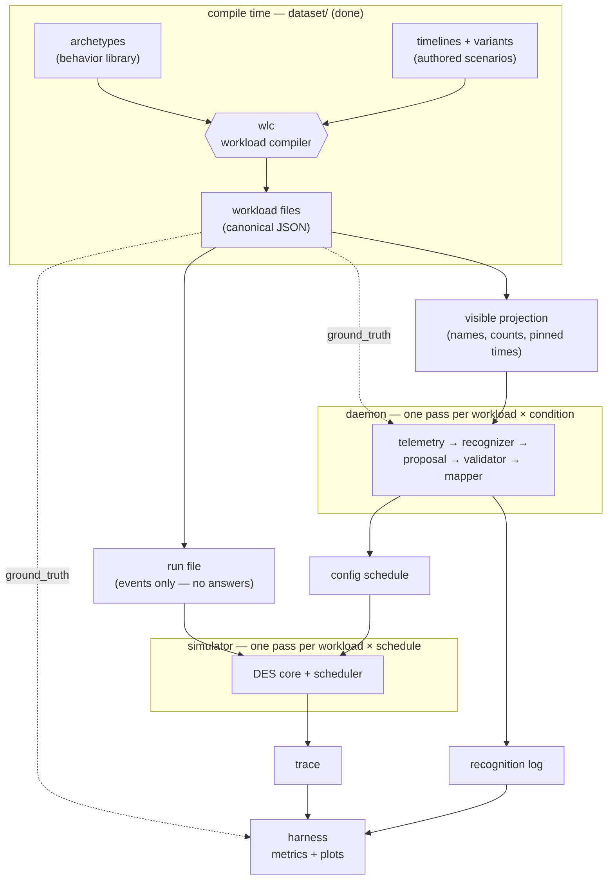

# Data Contracts — every format in the project, with examples
> Status: draft · Created 2026-08-28 · Updated 2026-08-28

Everything the three of us build talks to everything else through data — a file one side writes and another side reads. Each such format is a **contract**: as long as both sides honor it, we can work independently and integration stays boring. This document lists every contract in the project, shows what each one looks like with real (or, where not yet frozen, illustrative) examples, and explains every example in plain sentences. Same audience as `background-guide.md`: general CS knowledge is enough, no OS background needed.

Three contracts are **frozen** — real files exist today and code already enforces them. The rest are **drafts** — their shape is agreed at the level shown here, but the exact schemas are a decision the three of us make together at the protocol freeze (and once frozen, changing one requires everyone's sign-off plus a changelog entry).

---

## 1. How everything connects

The single most important framing fact: **the simulator and the daemon never talk to each other at run time.** Both are offline programs that read files and write files. The daemon does all of its recognition work *before* any simulation happens, and hands the simulator a finished schedule of configurations. The whole experiment is a pipeline of files:



Read it as one piece of data's life story:

1. **Compile time** (already done, lives in `dataset/`): the **archetype** library says how each kind of process behaves, **timelines** say which processes are on stage when and what each moment truly means, and **wlc** — the workload compiler — combines them, rolls all the dice once, and writes **canonical workload files**. This half is finished and frozen; nobody re-runs it during experiments.
2. From each workload file, two **views** are derived, one per consumer, so that the information asymmetry is enforced by *which file a program is handed*, not by trusting code to skip keys: the **run file** (the events, stripped of the answer key — everything the simulator may see) and the **visible projection** (just the process names, counts, and pinned lifetimes — everything a recognizer may see).
3. The **daemon** takes the visible projection and runs the whole recognition pipeline offline: it renders the projection into **telemetry** snapshots, feeds each one to a **recognizer** (the LLM, or the whitelist, or random — one per experimental condition; the oracle condition reads `ground_truth` instead of the projection), validates and clamps what comes back, maps it to scheduler settings, and writes two outputs: a **config schedule** (for the simulator) and a **recognition log** (for the grader).
4. The **simulator** takes the run file plus a config schedule and plays the workload out under it, writing a **trace** of everything that happened.
5. The **harness** reads traces and recognition logs after the fact and computes every metric and plot in the paper — comparing conditions, and comparing recognition logs against `ground_truth`.

The dotted lines are the deliberate cheat paths, and they are the experiment's core design: `ground_truth` reaches only the oracle recognizer and the grader. The simulator never sees it (the run file doesn't contain it); the LLM never sees it (the projection doesn't contain it).

| # | Contract | Shape | Producer → Consumer | Status |
|---|---|---|---|---|
| 1 | Archetype | YAML, `dataset/archetypes.yaml` | measurements/literature → wlc | **frozen** (v0.1) |
| 2 | Timeline (+ variant) | YAML, `dataset/timelines/` | human authors → wlc | **frozen** |
| 3 | Workload (canonical) | JSON, `dataset/build/`, schema `dataset/schema/workload.schema.json` | wlc → the two views, oracle, grader | **frozen** |
| 3a | Run file (view of 3) | JSON | dataset tooling → simulator | draft |
| 3b | Visible projection (view of 3) | JSON | dataset tooling → daemon | draft |
| 4 | Config schedule | JSON | daemon → simulator | draft |
| 5 | Recognition log | JSON | daemon → harness | draft |
| 6 | Telemetry / Proposal | JSON, internal to the daemon | daemon-internal (recorded in 5) | draft |
| 7 | Trace | event log (e.g. JSONL) | simulator → harness | draft |

---

## 2. Archetype — how one kind of process behaves

**Frozen (v0.1). File: `dataset/archetypes.yaml`. Read only by wlc, at compile time — the simulator never sees archetypes.**

An archetype is a reusable behavior template: "things of this kind use the CPU in this pattern." There are twelve (`audio-playback`, `video-playback`, `desktop-interactive`, `cpu-batch`, `compiler-child`, `build-orchestrator`, `io-stream`, `background-crawler`, `game-task-chain`, `network-bulk`, `electron-comms`, `system-daemon`). Every number in the library is either taken from published measurements or measured by us in CI, and each value records its source.

### Example A — the simplest one, `cpu-batch`

```yaml
cpu-batch:
  category_source: interbench
  pattern:
    program:
      - RUN: total_work
      - EXIT: {}
  params: {}
  lifetime: finite
  binding_params: [total_work]
```

In sentences: this archetype describes any process that simply computes until it is done — a training run, a virus scan in full swing, a renderer. Its behavior `program` is two steps: burn CPU for `total_work` amount of time, then exit. It carries no `params` of its own, because how *big* the job is depends on the scenario, not on the kind of process — so `total_work` is listed under `binding_params`, meaning "the timeline that uses me must supply this value." Its `lifetime: finite` says the process ends by finishing its work (whenever the scheduler lets that happen), rather than by the user closing it. `category_source: interbench` records where this behavior class comes from — the interbench benchmark's "Burn" load is the community's standard model of CPU saturation. (The real entry carries two more fields this excerpt trims: `validation_stats`, which says how the entry was checked, and `modeling_notes`, prose recording every modeling judgment — for instance, that the P1 experiment pair deliberately binds a file indexer's *full-rescan* state to `cpu-batch`.)

### Example B — a distribution-heavy one, `desktop-interactive` (abridged)

Before reading it, one convention that governs every number in the library: a parameter is never a bare value but a **distribution object** — `{dist, …parameters…, sampling, source}`. The `dist` field names the distribution family (`constant` for point values, `uniform`, `lognormal`, mixtures), the family's parameters follow, `sampling` says how often wlc draws from it (`per-instance`: once per task; `per-task`: one draw reused across iterations; `per-iteration`: a fresh draw every loop turn), and `source` names the citation or measurement the value stands on. Nothing in the library is an unsourced number.

```yaml
desktop-interactive:
  category_source: interbench
  pattern:
    program:
      - loop:
          - WAIT: input
          - RUN: burst
  params:
    input_gap:
      dist: lognormal-mixture
      fluent_mean_us: 158000        # ~158 ms between keystrokes while typing fluently
      pause_probability: 0.34       # about a third of gaps are think-pauses instead
      pause_mean_us: 395235
      sampling: per-iteration
      source: dhakal-chi18
    burst_fraction:
      dist: uniform
      min: 0.0
      max: 1.0
      sampling: per-iteration
      source: interbench:man-x
  lifetime: segment-bound
  binding_params: []
```

In sentences: this archetype describes an app a human is actively using — an editor, mostly. Its program is an endless loop of "wait for input, then do a short burst of work." Unlike `cpu-batch`, its `params` are **distributions, not constants**: `input_gap` says the time between one keystroke and the next is drawn from a two-component lognormal — fluent typing averages about 158 ms between keys, but with probability 0.34 the gap is a longer think-pause instead — and the `source` tags say exactly which paper or measurement each number comes from. `sampling: per-iteration` means wlc draws a *fresh* value for every loop turn (that's why a compiled editor program is hundreds of concrete numbers, no two alike). `lifetime: segment-bound` means this process ends when the "user" closes it — at a time pinned in the timeline — rather than by finishing. And note what an archetype *never* contains: a process name. `code`, `soffice.bin` and a fake name from the familiarity ladder can all bind to this same behavior; that separation of name from behavior is what several experiments are built on.

---

## 3. Timeline — who is on stage, when, and what it truly means

**Frozen. Files: `dataset/timelines/coreset/*.timeline.yaml` (scenarios) and `*.variant.yaml` (derivation recipes). Read only by wlc.**

A timeline is a hand-authored scenario script. Where an archetype says how one process *behaves*, a timeline says which processes *exist*, over what time span, and — crucially — what the machine is *really* being used for at each moment, which becomes the workload's hidden ground truth.

### Example A — a complete timeline, `c2-p1a` (this is the entire real file)

```yaml
meta:
  id: c2-p1a
  seed: 201

segments:
  - {from: 0s,  to: 60s,  mode: dev,      attributes: {background_wanted: true},
     scenario: [S11]}
  - {from: 60s, to: 180s, mode: ml-train, attributes: {background_wanted: true},
     scenario: [S11, S12]}

tasks:
  - {id: editor, name: code, archetype: desktop-interactive,
     arrive: 0s, depart: 180s}
  - {id: hog, name: python3, archetype: cpu-batch, arrive: 60s,
     bind: {total_work: 130s}}

focus:
  - {from: 2s, to: 178s, task: editor}
```

In sentences: this three-minute scenario is "a developer writing code, and at the one-minute mark they kick off an ML training run." The `segments` block is the ground-truth labeling: for the first 60 seconds the machine's situation is `dev` (development work); from 60 s to 180 s it is `ml-train`, and in both segments the background work is `wanted` — the user asked for it. (The `scenario` tags key each segment to the catalog of documented real-world co-occurrence patterns; they justify *why* this combination is realistic.) The `tasks` block puts two processes on stage: a task with internal id `editor`, wearing the process name `code`, behaving per the `desktop-interactive` archetype, present from 0 s until the user closes it at 180 s; and a task with id `hog`, named `python3`, behaving per `cpu-batch`, arriving at 60 s. Because `cpu-batch` demands a `total_work` binding, the timeline supplies it here: 130 seconds of CPU to chew through. The `focus` block says which task the (simulated) user's attention and input stream belong to. And `seed: 201` is the dice-roll recorded for reproducibility: compiling this file with this seed always yields the byte-identical workload.

One more timeline field worth knowing: **`count:`**. A task entry like `{id: renderers, name: chrome, archetype: electron-comms, count: 12}` (from the real `c1-browsing`) is multiplicity sugar — wlc expands it into 12 separate tasks (`renderers.1` … `renderers.12`), each with its own independently-sampled program, all wearing the name `chrome`. That is deliberate realism: a real process list during browsing shows a dozen identically-named Chrome processes, one per tab group.

### Example B — a variant recipe (an excerpt of the real `c2-pairs.variant.yaml`)

```yaml
variants:
  - id: c2-p1b
    from: c2-p1a.timeline.yaml
    ops:
      - rename: {from: python3, to: tracker-miner-fs-3}
      - patch-segment: {index: 1, mode: indexing,
                        attributes: {background_wanted: false}}
```

In sentences: many coreset files are deliberate near-copies of each other, and rather than maintaining two hand-written files that must stay identical except in one spot, we write the difference itself. This recipe says: take `c2-p1a` from Example A, rename the process `python3` to `tracker-miner-fs-3` (the GNOME file indexer), and re-label the second segment as `indexing` with `wanted: false`. Nothing else changes — same behavior, same seed, same timings, byte for byte. The result is the project's sharpest experimental pair: two workloads a scheduler cannot tell apart by any measurement, where the *right* treatment differs, and the only distinguishing information is the name. The derivation ops (`rename`, `patch-segment`, `patch-task`, …) are executed by wlc's deriver, and the derived timeline is regenerated and verified in CI, so the "identical except for exactly this" property is enforced by machinery rather than by care.

---

## 4. Workload (canonical) — the compiled master file, and its two views

**Frozen. Files: `dataset/build/coreset-{single,native}/*.workload.json`. Schema: `dataset/schema/workload.schema.json`. Produced by wlc.**

This is the file at the center of everything — everything soft in the two contracts above (distributions, archetype references, sugar) resolved to hard numbers. One file has three top-level keys, and *no experiment component reads the whole file*: each consumer gets a derived view containing only its slice.

### Example A — `meta` and `ground_truth` (real, from the compiled `c2-p1a`)

```jsonc
"meta": {
  "id": "c2-p1a",
  "derived_from": "dataset/timelines/coreset/c2-p1a.timeline.yaml@2aa49c7…",
  "sampled": { "seed": 201, "archetypes": "archetypes.yaml@99495a3…" }
},
"ground_truth": [
  { "t_start": 0,        "t_end": 60000000,  "mode": "dev",      "attributes": { "background_wanted": true } },
  { "t_start": 60000000, "t_end": 180000000, "mode": "ml-train", "attributes": { "background_wanted": true } }
]
```

In sentences: `meta` is pure provenance — which timeline at which git commit produced this file, sampled from which library commit with which seed — so any number anywhere in the file can be traced to its origin. `ground_truth` is the timeline's `segments` block carried through compilation: the same two labeled intervals, now in integer **microseconds** (60000000 µs = 60 s — all times in this format are integer microseconds, everywhere). This is the answer key: only the oracle recognizer and the accuracy grader may read it.

### Example B — three `arrive` events showing the three kinds of task

```jsonc
// (1) An interactive, segment-bound task — the editor. Its program is a long
//     flat list of concrete numbers; every value was drawn at compile time.
{ "op": "arrive", "t": 0, "id": "editor", "name": "code", "depart": 180000000,
  "program": [
    { "op": "WAIT", "channel": "input:editor" },
    { "op": "RUN",  "us": 23439 },
    { "op": "WAIT", "channel": "input:editor" },
    { "op": "RUN",  "us": 253642 }
    // …hundreds more pairs, all different
  ] }

// (2) A periodic task — a game's frame producer (from c1-gaming).
{ "op": "arrive", "t": 0, "id": "game.chain.1", "name": "game.exe", "depart": 60000000,
  "program": [
    { "op": "LOOP", "count": "unbounded", "body": [
        { "op": "TIMER", "period_us": 16667 },
        { "op": "RUN",   "us": 646 },
        { "op": "WAKE",  "target": "game.chain.2" }
    ] }
  ] }

// (3) An orchestrator — `make` driving 100 compiler children (from c1-compile).
{ "op": "arrive", "t": 2000000, "id": "build", "name": "make", "fork_cap": 8,
  "program": [ { "op": "RUN", "us": 105 }, { "op": "FORK" },
               { "op": "RUN", "us": 653 }, { "op": "FORK" } /* …98 more… */ ],
  "spawn_table": [
    { "id": "build.c1", "name": "cc1",
      "program": [ { "op": "RUN", "us": 664 }, { "op": "SLEEP", "us": 3126 },
                   { "op": "RUN", "us": 9 }, { "op": "EXIT" } ] }
    // …one fully-written entry per child, 100 in total
  ] }
```

In sentences, one per task: **(1)** the editor arrives at time zero and will be forcibly removed at exactly t = 180 s (`depart` present = segment-bound — the "user" closes it). Its program alternates "wait for a keystroke on my input channel" with "compute for exactly this many microseconds" — 23,439 µs, then 253,642 µs, and so on; the variety that was a distribution in the archetype is now literal numbers. **(2)** the frame producer runs a compact endless loop: wait for the next tick of a 16,667 µs metronome (that's 60 frames per second), do 646 µs of frame work, then wake the next stage of the frame pipeline — sixteen tasks pass each frame down a bucket brigade this way, and the compiled `c1-gaming` contains **300 tasks named `game.exe`** (the chain plus hundreds of small helpers the constructor expands). The metronome ticks on a fixed grid, so a late frame doesn't push the schedule later; missed ticks pile up as backlog. **(3)** `make` arrives at t = 2 s carrying a `spawn_table`: a pre-written list of 100 compiler children, each with its own complete program already sampled. Each `FORK` in make's program launches the next child from the table, but never more than `fork_cap: 8` alive at once — exactly `make -j8`. Which children exist is fixed in the file; *when* each one gets to start depends on how the scheduler treats the family. Note also (3) has no `depart` and its children end in `EXIT`: those are the other two lifetime classes, finite and spawned.

### Example C — a `wake` event (the other, and only other, event kind)

```jsonc
{ "op": "wake", "t": 2098333, "channel": "input:editor", "target": "editor" }
```

In sentences: at exactly t = 2.098333 s, a keystroke arrives for the editor. If the editor is currently blocked in a `WAIT` on channel `input:editor`, it becomes runnable and its next `RUN` burst begins competing for CPU. A workload file contains hundreds of these — they are the pre-sampled trace of the simulated human's hands, pinned to absolute times so that every experimental condition faces the identical user.

### The two derived views

**Draft — the shapes below are agreed; wiring them into wlc as build artifacts is pending dataset-side work. Until then, consumers read `*.workload.json` and take only their slice.**

**Run file** (`simulator` input): the workload minus everything the simulator must not see — `ground_truth` gone, `meta` reduced to the id. Structurally it is just the `events` list:

```jsonc
{ "workload_id": "c2-p1a",
  "events": [ /* exactly the arrive and wake events of Example B and C */ ] }
```

**Visible projection** (`daemon` input): what a recognizer is entitled to know — names, counts, and *pinned* lifetime times only. No programs, no burst durations, no labels. From `c1-compile`:

```jsonc
{ "workload_id": "c1-compile",
  "tasks": [
    { "name": "code", "t_arrive": 0, "t_depart": 60000000 },
    { "name": "make", "t_arrive": 2000000,
      "children": [ { "name": "cc1", "count": 100 } ] }
  ] }
```

In sentences: the projection says a process named `code` exists from 0 to 60 s (its depart is pinned, so the projection may know it), and a process named `make` appears at 2 s with no known end (it's finite — when it ends is a scheduling outcome, so the projection *cannot* contain it). The `children` entry handles spawn tables: *which* children `make` will create is compile-time knowledge — a hundred processes named `cc1` — so they are visible, attributed to their parent's lifetime; *when* each individually starts and stops is emergent and therefore absent. This is what lets a recognizer see the `{code, make, cc1×100}` swarm that reads as "compile," without leaking any behavioral ground truth. Multiplicity from `count:` expansion shows up the same way: `c1-browsing`'s projection is simply `chrome` with a count of 13.

---

## 5. Config schedule — what the daemon hands the simulator

**Draft — this is the contract to freeze first, since both sides build against it. Flows daemon → simulator, one file per workload × condition.**

```jsonc
{
  "workload_id": "c2-p1a",
  "condition": "llm_vocab",                     // who produced this schedule
  "schedule": [
    { "t_us": 0,                                // every schedule starts at t=0
      "config": { "algorithm": "MLFQ",
                  "params": { "num_queues": 3, "timeslice_us": 2000,
                              "boost_interval_us": 100000 },
                  "batch_bandwidth_cap": null },
      "provenance": "fallback" },               // boot default — no recognition yet

    { "t_us": 60450000,                         // set changed at 60 s + 450 ms latency
      "config": { "algorithm": "MLFQ",
                  "params": { "num_queues": 3, "timeslice_us": 2000,
                              "boost_interval_us": 100000 },
                  "batch_bandwidth_cap": 0.15 },
      "provenance": "unmodified" }
  ]
}
```

In sentences: a config schedule is a small, finished list of "at virtual time T, the scheduler's settings become C." The simulator applies each entry at its time as just another event — it neither knows nor cares whether the schedule came from an LLM, a whitelist, a random draw, or the oracle; that ignorance is what makes conditions comparable. The first entry is always at t = 0 and is the boot default (plain MLFQ), because recognition hasn't seen anything yet. The second entry is the daemon's reaction to the training run appearing at 60 s — note its timestamp is 60 s *plus 450 ms*: the daemon stamps configs late by its measured recognition latency, which is how LLM slowness remains an honest, measured part of the experiment even though inference ran offline. (The oracle daemon stamps exactly 60000000 — perfect recognition has zero delay; the `fixed` condition emits a one-entry schedule and never changes.) The `config` payload is algorithm-dependent — an EDF entry would carry `{ "algorithm": "EDF", "params": { "admission_slack_us": 2000 }, "batch_bandwidth_cap": 0.12 }`, a lottery entry ticket shares — and each entry carries its `provenance`: `unmodified` (proposal applied as-is), `clamped` (pulled into legal bounds), `held` (proposal rejected; previous config carried forward), or `fallback` (the default, from boot or after repeated failures). Every performance figure in the paper is reported next to the provenance breakdown of the schedule that produced it, because a condition that scored well while mostly running fallback demonstrated nothing about recognition.

---

## 6. Recognition log — what the daemon hands the grader

**Draft. Flows daemon → harness, one file per workload × condition. The config schedule is what recognition *decided*; this is the record of what it *thought*.**

```jsonc
{
  "workload_id": "c2-p1a",
  "condition": "llm_vocab",
  "queries": [
    { "t_set_change": 60000000,                 // the pinned event that triggered this query
      "telemetry": { "processes": [ { "name": "code",    "count": 1 },
                                    { "name": "python3", "count": 1 } ] },
      "proposal": {
        "reasoning": "code is an editor in active use. python3 alongside an editor at
                      sustained CPU most plausibly reads as a training or data job the
                      developer just started; work the user initiated should keep
                      progressing in the background.",
        "situation": "Development with a user-initiated training run",
        "system": { "mode": "ml-train", "background_wanted": true }
      },
      "validation": "unmodified",
      "latency_us": 450000 }
  ]
}
```

In sentences: one entry per **query point** — each pinned set change that made the daemon consult its recognizer. The entry records the exact telemetry snapshot the recognizer was shown (so grading is self-contained and auditable), the full proposal that came back, what the validator did with it, and how long recognition took. Layer-1 metrics — mode accuracy, per-attribute accuracy, the confusion matrix, consistency across repeated runs, accuracy split by software familiarity — are all computed by comparing these entries against `ground_truth`, with no simulator involved at all. The `reasoning` field is never scored automatically; it is read by humans during failure analysis, because it distinguishes "the model didn't know what the software was" (a knowledge limit) from "it knew and drew the wrong conclusion" (a fixable prompt or mapping problem). For non-LLM conditions the log still exists but is thinner — the whitelist logs which rule matched; the oracle logs the ground-truth row it read; `random` logs its draw — so every condition's decisions are auditable in the same place.

---

## 7. Telemetry and proposal — the shapes inside the daemon

**Draft. These two never cross a tree boundary as files of their own — telemetry is built inside the daemon from the visible projection, and the proposal is the recognizer's raw answer before validation. Both are preserved verbatim inside the recognition log. They still deserve their own section, because they are the shapes the daemon's internals — and the LLM prompt — are built around.**

### Telemetry — a snapshot of "what exists right now"

```jsonc
// just before the 60-second mark: only the editor exists
{ "t_us": 59000000, "processes": [ { "name": "code", "count": 1 } ] }

// at the 60-second mark the training run arrives — the set changed
{ "t_us": 60000000, "processes": [ { "name": "code",    "count": 1 },
                                   { "name": "python3", "count": 1 } ] }
```

In sentences: the daemon walks the visible projection's pinned events (arrivals and pinned departs) in time order and maintains the set of live process names with counts; each change of that set is one telemetry snapshot, and each snapshot is one query point. The transition between the two snapshots above is the moment the whole system turns on: the set changed, so the recognizer is consulted. During the 59 stable seconds before it, *nothing* is queried — an unchanged set means an unchanged answer, and re-asking would produce 59 identical responses for nothing. Names arrive with counts (`chrome × 13`, `game.exe × 300`, `cc1 × 100`) because the count is itself signal: thirteen chromes read as a browser with tabs; a hundred `cc1` read as a parallel build. What telemetry deliberately **excludes** defines the experiment: no PIDs, no CPU or burst statistics (that is the hidden behavioral ground truth being tested against), no mode labels (that is the answer), and no command lines (canonical files carry names only — a frozen dataset decision). Two consequences of the pinned-events-only rule, stated honestly: the recognizer reacts to *launches* and *user-closes*, never to background jobs finishing (a finite task that exits never disappears from telemetry), and spawn children appear when their parent does. When results look ambiguous there will be a temptation to "just give the model a bit more context"; the frozen telemetry shape is what makes that a visible protocol change rather than a quiet experiment-invalidating tweak.

### Proposal — the recognizer's raw answer

```jsonc
{
  "reasoning": "code is a programmer's editor and is the focus of input. python3 arriving
                and computing steadily beside it is most plausibly a training or data job
                the developer started deliberately, so it is wanted background work —
                it should be throttled below the editor, not deferred outright.",

  "situation": "Development with a user-initiated training run",

  "system": {
    "mode": "ml-train",
    "background_wanted": true
  },

  "subsystems": {
    "cpu_scheduler": {
      "algorithm": "MLFQ",
      "params": { "num_queues": 3, "timeslice_us": 2000, "boost_interval_us": 100000 },
      "batch_bandwidth_cap": 0.15
    }
  }
}
```

In sentences: the proposal has four parts with sharply different fates. `reasoning` is mandatory prose — the model must explain its reading *before* concluding; it flows to the recognition log only. `situation` is a one-line human summary, same destination. `system` is the heart of the contract: the machine-readable claim about the world, in the closed shared vocabulary fixed by `recognition-vocabulary.md` — exactly one `mode` from the 16-entry menu plus the boolean `background_wanted`. It is subsystem-neutral: a power-management driver could act on this very same block. `subsystems` is a namespace of per-consumer suggestions — this project only ever fills `cpu_scheduler` — and it is the *least* trusted part: depending on the experiment variant it is ignored entirely (variant A: only `system` is used, and the daemon's own driver table picks the configuration), consulted for the algorithm choice only (variant B), or taken in full (variant C). The model may never invent vocabulary: an unknown mode, attribute, or subsystem key is rejected by the validator, full stop.

---

## 8. Trace — what happened, written down

**Draft — the harness and simulator sides propose and freeze the exact format together. Flows simulator → harness. Illustrative lines:**

```jsonl
{"t": 0,        "event": "config_applied", "algorithm": "MLFQ", "provenance": "fallback"}
{"t": 0,        "event": "run_start", "task": "editor"}
{"t": 3000,     "event": "block",     "task": "editor",  "reason": "wait"}
{"t": 3000,     "event": "run_start", "task": "hog"}
{"t": 11000,    "event": "preempt",   "task": "hog",     "reason": "slice_expired"}
{"t": 16667,    "event": "deadline",  "task": "game.chain.16", "met": true, "slack_us": 1042}
{"t": 60450000, "event": "config_applied", "algorithm": "MLFQ", "provenance": "unmodified"}
```

In sentences: the trace is the simulator's only real product — an append-only log of everything that happened, from which the harness computes every metric after the fact; the simulator itself computes no statistics. The `run_start`/`block`/`preempt` lines carve the CPU timetable: the editor started running at t = 0, gave up the lane at t = 3 ms because it hit a `WAIT`, the hog took over, and at t = 11 ms the scheduler forcibly paused the hog because its time slice ran out. Response time, turnaround, throughput and starvation all fall out of lines like these. The `deadline` line is emitted once per periodic job: this frame met its due time with 1,042 µs to spare — deadline miss rate and P99 frame latency are computed from these. The `config_applied` lines record each config-schedule entry taking effect, echoing its provenance, so any stretch of the timetable can be attributed to the configuration that governed it. Two properties matter more than the exact field names: the trace must be **deterministic** (same run file + same schedule ⇒ bit-identical log — this doubles as the reproducibility test) and **flat** (a simple line-per-event log that can be streamed; these files get large).

---

## 9. Terms used in this document

| Term | Meaning here |
|---|---|
| **contract** | a data format two components agree on, so each side can be built and tested alone |
| **frozen** | the format exists, real files conform to it, and code/CI enforces it; changing it is a team decision |
| **draft** | the intended shape is agreed at the level shown here, but the exact schema awaits the protocol freeze |
| **schema** | a machine-checkable description of a format (like `workload.schema.json`) — validation, not documentation |
| **view** | a derived file containing only the slice of the workload one consumer may see (run file, visible projection) |
| **binding** | a timeline attaching a concrete process name and scenario-specific values (like `total_work`) to an archetype |
| **segment** | one labeled interval of a workload: a stretch of time with a constant mode and attributes |
| **query point** | a pinned set change in the visible projection — the moments the daemon consults its recognizer |
| **snapshot** | one telemetry message: the set of live process names (with counts) at one moment |
| **pinned / emergent** | times fixed in the workload file (arrivals, wakes, user-closes) vs. times that depend on scheduling (finite-task exits, spawn starts) |
| **closed vocabulary** | a fixed menu of allowed values (modes, attributes, ops); anything outside the menu is rejected, never improvised |
| **provenance** | the recorded origin story of a piece of data — a config entry's `unmodified/clamped/held/fallback` stamp, or a workload's `meta` block |
| **condition** | one rung of the experiment ladder (`fixed`, `random`, `whitelist`, `llm_*`, `oracle`) — realized as one daemon recognizer |
| **JSONL** | "JSON Lines": a log where each line is one standalone JSON object; trivially appendable and streamable |
| **protocol freeze** | the deliberate moment the draft contracts harden; afterwards, changes require all three of us plus a changelog entry |

## 10. The freeze rule

The three frozen contracts (archetype, timeline, workload) are enforced by schema and CI today. The drafts — the two views, the config schedule, the recognition log, the daemon-internal telemetry/proposal shapes, and the trace — harden in one deliberate step, the **protocol freeze**, because they are exactly the seams where the three of us could silently build against three slightly different assumptions and discover it at integration time. The config schedule freezes first: both the daemon and the simulator build against it from day one. After the freeze, any change to any contract needs all three of us and a changelog entry. Until then, the drafts above are the shared starting point: build to them, and bring friction to the freeze discussion rather than working around it quietly.
