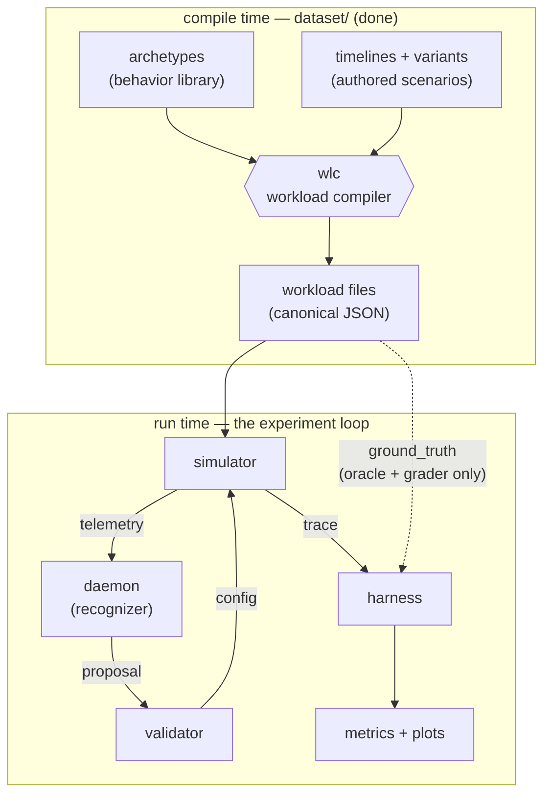

# Data Contracts — every format in the project, with examples
> Status: draft · Created 2026-08-28 · Updated 2026-08-28

Everything the three of us build talks to everything else through data — a file one side writes and another side reads. Each such format is a **contract**: as long as both sides honor it, we can work independently and integration stays boring. This document lists every contract in the project, shows what each one looks like with real (or, where not yet frozen, illustrative) examples, and explains every example in plain sentences. Same audience as `simulator/background-guide.md`: general CS knowledge is enough, no OS background needed.

There are seven contracts. Three are **frozen** — real files exist today and code already enforces them. Four are **drafts** — their shape is sketched in the research proposal, but the exact schemas are a decision the three of us make together (and once frozen, changing one requires everyone's sign-off plus a changelog entry).

---

## 1. How everything connects



Read it top to bottom, following one piece of data through its whole life:

1. **Compile time** (already done, lives in `dataset/`): the **archetype** library says how each kind of process behaves, **timelines** say which processes are on stage when and what each moment truly means, and **wlc** — the workload compiler — combines them, rolls all the dice once, and writes **canonical workload files**. This half is finished and frozen; nobody re-runs it during experiments.
2. **Run time** (the loop we're building): the **simulator** eats a workload file and plays it out. As it runs, it reports which processes currently exist — that's **telemetry** — to the **daemon**, whose recognizer (the LLM, or a baseline standing in for it) answers with a **proposal**: "here is what I think this machine is doing, and what I suggest." The **validator** checks the proposal against hard rules and turns the surviving part into a **config** — the scheduler settings actually applied. Meanwhile the simulator writes down everything that happens into a **trace**, and the **harness** reads traces afterward to compute every metric and plot in the paper.
3. The dotted line is the deliberate cheat path: the **ground truth** inside each workload file goes only to the oracle condition and the grading code. The scheduler never sees it; the LLM never sees it. That information asymmetry is the experiment's core design, enforced by which component is handed which piece of data.

| # | Contract | Shape | Producer → Consumer | Status |
|---|---|---|---|---|
| 1 | Archetype | YAML, `dataset/archetypes.yaml` | measurements/literature → wlc | **frozen** (v0.1) |
| 2 | Timeline (+ variant) | YAML, `dataset/timelines/` | human authors → wlc | **frozen** |
| 3 | Workload (canonical) | JSON, `dataset/build/`, schema `dataset/schema/workload.schema.json` | wlc → simulator, oracle, grader | **frozen** |
| 4 | Telemetry | JSON messages | simulator → daemon | draft |
| 5 | Proposal | JSON messages | daemon → validator | draft |
| 6 | Config | JSON / struct | validator → simulator's executor | draft |
| 7 | Trace | event log (e.g. JSONL) | simulator → harness | draft |

---

## 2. Archetype — how one kind of process behaves

**Frozen (v0.1). File: `dataset/archetypes.yaml`. Read only by wlc, at compile time — the simulator never sees archetypes.**

An archetype is a reusable behavior template: "things of this kind use the CPU in this pattern." There are twelve (`audio-playback`, `video-playback`, `desktop-interactive`, `cpu-batch`, `compiler-child`, `build-orchestrator`, `io-stream`, `background-crawler`, `game-task-chain`, `network-bulk`, `electron-comms`, `system-daemon`). Every number in the library is either taken from published measurements or measured by us in CI, and each value records its source.

### Example A — the simplest one, `cpu-batch`

```yaml
cpu-batch:
  category_source: interbench
  pattern:
    program:
      - RUN: total_work
      - EXIT: {}
  params: {}
  lifetime: finite
  binding_params: [total_work]
```

In sentences: this archetype describes any process that simply computes until it is done — a training run, a virus scan in full swing, a renderer. Its behavior `program` is two steps: burn CPU for `total_work` amount of time, then exit. It carries no `params` of its own, because how *big* the job is depends on the scenario, not on the kind of process — so `total_work` is listed under `binding_params`, meaning "the timeline that uses me must supply this value." Its `lifetime: finite` says the process ends by finishing its work (whenever the scheduler lets that happen), rather than by the user closing it. `category_source: interbench` records where this behavior class comes from — the interbench benchmark's "Burn" load is the community's standard model of CPU saturation. (The real entry carries two more fields this excerpt trims: `validation_stats`, which says how the entry was checked, and `modeling_notes`, prose recording every modeling judgment — for instance, that the P1 experiment pair deliberately binds a file indexer's *full-rescan* state to `cpu-batch`.)

### Example B — a distribution-heavy one, `desktop-interactive` (abridged)

```yaml
desktop-interactive:
  category_source: interbench
  pattern:
    program:
      - loop:
          - WAIT: input
          - RUN: burst
  params:
    input_gap:
      dist: lognormal-mixture
      fluent_mean_us: 158000        # ~158 ms between keystrokes while typing fluently
      pause_probability: 0.34       # about a third of gaps are think-pauses instead
      pause_mean_us: 395235
      sampling: per-iteration
      source: dhakal-chi18
    burst_fraction:
      dist: uniform
      min: 0.0
      max: 1.0
      sampling: per-iteration
      source: interbench:man-x
  lifetime: segment-bound
  binding_params: []
```

Before reading it, one convention that governs every number in the library: a parameter is never a bare value but a **distribution object** — `{dist, …parameters…, sampling, source}`. The `dist` field names the distribution family (`constant` for point values, `uniform`, `lognormal`, mixtures), the family's parameters follow, `sampling` says how often wlc draws from it (`per-instance`: once per task; `per-task`: one draw reused across iterations; `per-iteration`: a fresh draw every loop turn), and `source` names the citation or measurement the value stands on. Nothing in the library is an unsourced number.

In sentences: this archetype describes an app a human is actively using — an editor, mostly. Its program is an endless loop of "wait for input, then do a short burst of work." Unlike `cpu-batch`, its `params` are **distributions, not constants**: `input_gap` says the time between one keystroke and the next is drawn from a two-component lognormal — fluent typing averages about 158 ms between keys, but with probability 0.34 the gap is a longer think-pause instead — and the `source` tags say exactly which paper or measurement each number comes from. `sampling: per-iteration` means wlc draws a *fresh* value for every loop turn (that's why a compiled editor program is hundreds of concrete numbers, no two alike). `lifetime: segment-bound` means this process ends when the "user" closes it — at a time pinned in the timeline — rather than by finishing. And note what an archetype *never* contains: a process name. `code`, `soffice.bin` and a fake name from the familiarity ladder can all bind to this same behavior; that separation of name from behavior is what several experiments are built on.

---

## 3. Timeline — who is on stage, when, and what it truly means

**Frozen. Files: `dataset/timelines/coreset/*.timeline.yaml` (scenarios) and `*.variant.yaml` (derivation recipes). Read only by wlc.**

A timeline is a hand-authored scenario script. Where an archetype says how one process *behaves*, a timeline says which processes *exist*, over what time span, and — crucially — what the machine is *really* being used for at each moment, which becomes the workload's hidden ground truth.

### Example A — a complete timeline, `c2-p1a` (this is the entire real file)

```yaml
meta:
  id: c2-p1a
  seed: 201

segments:
  - {from: 0s,  to: 60s,  mode: dev,      attributes: {wanted: true},
     scenario: [S11]}
  - {from: 60s, to: 180s, mode: ml-train, attributes: {wanted: true},
     scenario: [S11, S12]}

tasks:
  - {id: editor, name: code, archetype: desktop-interactive,
     arrive: 0s, depart: 180s}
  - {id: hog, name: python3, archetype: cpu-batch, arrive: 60s,
     bind: {total_work: 130s}}

focus:
  - {from: 2s, to: 178s, task: editor}
```

In sentences: this three-minute scenario is "a developer writing code, and at the one-minute mark they kick off an ML training run." The `segments` block is the ground-truth labeling: for the first 60 seconds the machine's situation is `dev` (development work); from 60 s to 180 s it is `ml-train`, and in both segments the background work is `wanted` — the user asked for it. (The `scenario` tags key each segment to the catalog of documented real-world co-occurrence patterns; they justify *why* this combination is realistic.) The `tasks` block puts two processes on stage: a task with internal id `editor`, wearing the process name `code`, behaving per the `desktop-interactive` archetype, present from 0 s until the user closes it at 180 s; and a task with id `hog`, named `python3`, behaving per `cpu-batch`, arriving at 60 s. Because `cpu-batch` demands a `total_work` binding, the timeline supplies it here: 130 seconds of CPU to chew through. The `focus` block says which task the (simulated) user's attention and input stream belong to. And `seed: 201` is the dice-roll recorded for reproducibility: compiling this file with this seed always yields the byte-identical workload.

### Example B — a variant recipe (an excerpt of the real `c2-pairs.variant.yaml`)

```yaml
variants:
  - id: c2-p1b
    from: c2-p1a.timeline.yaml
    ops:
      - rename: {from: python3, to: tracker-miner-fs-3}
      - patch-segment: {index: 1, mode: indexing,
                        attributes: {wanted: false}}
```

In sentences: many coreset files are deliberate near-copies of each other, and rather than maintaining two hand-written files that must stay identical except in one spot, we write the difference itself. This recipe says: take `c2-p1a` from Example A, rename the process `python3` to `tracker-miner-fs-3` (the GNOME file indexer), and re-label the second segment as `indexing` with `wanted: false`. Nothing else changes — same behavior, same seed, same timings, byte for byte. The result is the project's sharpest experimental pair: two workloads a scheduler cannot tell apart by any measurement, where the *right* treatment differs, and the only distinguishing information is the name. The derivation ops (`rename`, `patch-segment`, `patch-task`, …) are executed by wlc's deriver, and the derived timeline is regenerated and verified in CI, so the "identical except for exactly this" property is enforced by machinery rather than by care.

---

## 4. Workload (canonical) — the compiled, simulator-facing file

**Frozen. Files: `dataset/build/coreset-{single,native}/*.workload.json`. Schema: `dataset/schema/workload.schema.json`. Produced by wlc; read by the simulator, the oracle, and the grader.**

This is the contract at the center of everything — the only format the simulator ever reads. Everything soft in the two contracts above (distributions, archetype references, sugar) has been resolved to hard numbers. One file has three top-level keys, and different components are allowed to see different keys.

### Example A — `meta` and `ground_truth` (real, from the compiled `c2-p1a`)

```jsonc
"meta": {
  "id": "c2-p1a",
  "derived_from": "dataset/timelines/coreset/c2-p1a.timeline.yaml@2aa49c7…",
  "sampled": { "seed": 201, "archetypes": "archetypes.yaml@99495a3…" }
},
"ground_truth": [
  { "t_start": 0,        "t_end": 60000000,  "mode": "dev",      "attributes": { "wanted": true } },
  { "t_start": 60000000, "t_end": 180000000, "mode": "ml-train", "attributes": { "wanted": true } }
]
```

In sentences: `meta` is pure provenance — which timeline at which git commit produced this file, sampled from which library commit with which seed — so any number anywhere in the file can be traced to its origin; no scheduler logic may depend on it. `ground_truth` is the timeline's `segments` block carried through compilation: the same two labeled intervals, now in integer **microseconds** (60000000 µs = 60 s — all times in this format are integer microseconds, everywhere). This is the answer key: only the oracle condition and the accuracy grader may read it.

### Example B — three `arrive` events showing the three kinds of task

```jsonc
// (1) An interactive, segment-bound task — the editor. Its program is a long
//     flat list of concrete numbers; every value was drawn at compile time.
{ "op": "arrive", "t": 0, "id": "editor", "name": "code", "depart": 180000000,
  "program": [
    { "op": "WAIT", "channel": "input:editor" },
    { "op": "RUN",  "us": 23439 },
    { "op": "WAIT", "channel": "input:editor" },
    { "op": "RUN",  "us": 253642 }
    // …hundreds more pairs, all different
  ] }

// (2) A periodic task — a game's frame producer (from c1-gaming).
{ "op": "arrive", "t": 0, "id": "game.chain.1", "name": "game.exe", "depart": 60000000,
  "program": [
    { "op": "LOOP", "count": "unbounded", "body": [
        { "op": "TIMER", "period_us": 16667 },
        { "op": "RUN",   "us": 646 },
        { "op": "WAKE",  "target": "game.chain.2" }
    ] }
  ] }

// (3) An orchestrator — `make` driving 100 compiler children (from c1-compile).
{ "op": "arrive", "t": 2000000, "id": "build", "name": "make", "fork_cap": 8,
  "program": [ { "op": "RUN", "us": 105 }, { "op": "FORK" },
               { "op": "RUN", "us": 653 }, { "op": "FORK" } /* …98 more… */ ],
  "spawn_table": [
    { "id": "build.c1", "name": "cc1",
      "program": [ { "op": "RUN", "us": 664 }, { "op": "SLEEP", "us": 3126 },
                   { "op": "RUN", "us": 9 }, { "op": "EXIT" } ] }
    // …one fully-written entry per child, 100 in total
  ] }
```

In sentences, one per task: **(1)** the editor arrives at time zero and will be forcibly removed at exactly t = 180 s (`depart` present = segment-bound — the "user" closes it). Its program alternates "wait for a keystroke on my input channel" with "compute for exactly this many microseconds" — 23,439 µs, then 253,642 µs, and so on; the variety that was a distribution in the archetype is now literal numbers. **(2)** the frame producer runs a compact endless loop: wait for the next tick of a 16,667 µs metronome (that's 60 frames per second), do 646 µs of frame work, then wake the next stage of the frame pipeline — sixteen tasks pass each frame down a bucket brigade this way. The metronome ticks on a fixed grid, so a late frame doesn't push the schedule later; missed ticks pile up as backlog. **(3)** `make` arrives at t = 2 s carrying a `spawn_table`: a pre-written list of 100 compiler children, each with its own complete program already sampled. Each `FORK` in make's program launches the next child from the table, but never more than `fork_cap: 8` alive at once — exactly `make -j8`. Which children exist is fixed in the file; *when* each one gets to start depends on how the scheduler treats the family — that emergent timing is precisely what the experiment measures. Note also (3) has no `depart` and its children end in `EXIT`: those are the other two lifetime classes, finite and spawned.

### Example C — a `wake` event (the other, and only other, event kind)

```jsonc
{ "op": "wake", "t": 2098333, "channel": "input:editor", "target": "editor" }
```

In sentences: at exactly t = 2.098333 s, a keystroke arrives for the editor. If the editor is currently blocked in a `WAIT` on channel `input:editor`, it becomes runnable and its next `RUN` burst begins competing for CPU. A workload file contains hundreds of these — they are the pre-sampled trace of the simulated human's hands, pinned to absolute times so that every experimental condition faces the identical user.

---

## 5. Telemetry — what the recognizer is allowed to see

**Draft — the shape below is the proposal's sketch; the exact schema is a protocol decision we freeze together. Flows simulator → daemon.**

```jsonc
{
  "t_ms": 12400,
  "processes": [
    { "name": "League of Legends", "cmdline": "/opt/riot/LeagueClient --game" },
    { "name": "Discord",           "cmdline": "/usr/bin/discord" },
    { "name": "steam",             "cmdline": "/usr/bin/steam -applaunch download" }
  ],
  "counts": { "total": 3, "runnable": 2 }
}
```

And here is the same idea applied to our own running example, `c2-p1a`, as a *pair* of snapshots showing why snapshots exist at all:

```jsonc
// just before the 60-second mark: only the editor exists
{ "t_us": 59000000, "processes": [ { "name": "code" } ],
  "counts": { "total": 1 } }

// at the 60-second mark the training run arrives — the set changed
{ "t_us": 60000000, "processes": [ { "name": "code" }, { "name": "python3" } ],
  "counts": { "total": 2 } }
```

The transition between these two snapshots is the moment the whole system turns on: the process set changed, so a new telemetry snapshot is emitted, the daemon queries its recognizer, and a new proposal comes back. During the 59 stable seconds before it, *nothing* is queried — an unchanged set means an unchanged answer, and re-asking would produce 59 identical responses for nothing. Note also how little the recognizer has to go on here: `code` plus `python3` at 60 s, versus `code` plus `tracker-miner-fs-3` in the sibling file `c2-p1b` — one name is the entire difference it is given.

In sentences: a telemetry snapshot is the recognizer's entire view of the world — the names and command lines of the processes that currently exist, plus coarse counts, at a moment in time. It is a pure function of which tasks are alive in the simulator; a new snapshot is produced when the set changes (a launch or an exit), not on a timer. What it deliberately **excludes** defines the experiment: no PIDs (instances die and numbers get recycled — and we forbid per-instance rules anyway), no CPU-usage or burst statistics (that is the ground-truth behavior being tested against — giving it to the recognizer would let behavior leak in through the side door), and no mode labels (that is the answer). When results look ambiguous there will be a temptation to "just give the model a bit more context"; the frozen telemetry schema is what makes that a visible protocol change rather than a quiet experiment-invalidating tweak. One open note: our canonical files carry `name` only — whether a `cmdline` field survives into the frozen schema is one of the things the freeze decides.

---

## 6. Proposal — what the recognizer answers

**Draft — same caveat. Flows daemon → validator.**

```jsonc
{
  "reasoning": "LeagueClient is a game running in the foreground, so frame deadlines
                dominate. OBS is capturing and encoding that game in real time, which
                gives it a hard deadline of its own. The Steam download was started
                deliberately by the user, so it should be throttled, not starved.",

  "situation": "Gaming while streaming, with a user-initiated download",

  "system": {
    "mode": "gaming",
    "has_realtime_encoder": true,
    "background_is_wanted": true
  },

  "subsystems": {
    "cpu_scheduler": {
      "algorithm": "EDF",
      "params": { "admission_slack_ms": 2 },
      "batch_bandwidth_cap": 0.12
    }
  }
}
```

In sentences: the proposal has four parts with sharply different fates. `reasoning` is mandatory prose — the model must explain its reading *before* concluding, because when a run goes wrong we need to distinguish "it didn't know what OBS is" (a knowledge limit) from "it knew and drew the wrong conclusion" (a fixable mapping problem); this field flows to logs and evaluation only. `situation` is a one-line human summary, same destination. `system` is the heart of the contract: the machine-readable claim about the world, in a closed shared vocabulary — one `mode` from a fixed menu plus a small set of boolean `attributes`. It is subsystem-neutral: a power-management driver could act on this very same block. `subsystems` is a namespace of per-consumer suggestions — this project only ever fills `cpu_scheduler` — and it is the *least* trusted part: depending on the experiment variant it may be ignored entirely (variant A: only `system` is used, and the driver's own table picks the configuration), consulted for the algorithm choice only (variant B), or taken in full (variant C). The model may never invent vocabulary: an unknown mode, attribute, or subsystem key is rejected by the validator, full stop.

---

## 7. Config — what actually reaches the scheduler

**Draft — same caveat. Flows validator → the simulator's executor.**

```jsonc
// Example A — an EDF config, as applied during a gaming-while-streaming segment:
{
  "algorithm": "EDF",
  "params": { "admission_slack_ms": 2 },
  "batch_bandwidth_cap": 0.12,

  "provenance": "clamped",
  "as_of_t": 12400000
}

// Example B — the default config every run starts from (and falls back to):
{
  "algorithm": "MLFQ",
  "params": { "num_queues": 3, "timeslice_ms": 2, "boost_interval_ms": 100 },
  "batch_bandwidth_cap": null,

  "provenance": "fallback",
  "as_of_t": 0
}
```

Example A says: schedule by earliest deadline first (the right family when frames and encoder buffers dominate), admit deadline work with 2 ms of slack, and cap all batch-class work at 12% of the lane so the wanted download crawls forward but can never dent a frame. Its `provenance: clamped` records that the model's raw proposal had at least one value pulled into legal bounds by the validator before being applied. Example B is plain MLFQ with textbook parameters — the configuration active before any recognition has happened, and the one the system permanently retreats to after repeated failures; its provenance says exactly that.

In sentences: a config is the *validated, applied* scheduler setting — what survives after the proposal passes through the validator's rules. The payload fields depend on the chosen algorithm (an MLFQ config would instead carry `num_queues`, `timeslice_ms`, `boost_interval_ms`; a lottery config, ticket shares), so validation branches per algorithm, checking bounds and clamping out-of-range values. Two bookkeeping fields ride along and are non-negotiable in spirit. `provenance` records how this config came to be: `unmodified` (the proposal passed as-is), `clamped` (it was pulled into legal bounds), `held` (a proposal was rejected or absent, so the previous config stays), or `fallback` (repeated failures — we are back on default MLFQ). Every performance number in the paper must be reported next to the provenance breakdown, because a condition that scored well while mostly running fallback demonstrated nothing about recognition. `as_of_t` records the age of the observation behind the config — a config computed from a stale snapshot is applied knowingly, and the staleness is data. Hard floors live here too, not in the model's goodwill: bandwidth caps that prevent starvation are enforced by the executor no matter what any proposal says.

---

## 8. Trace — what happened, written down

**Draft — the harness and simulator sides propose and freeze the exact format together. Flows simulator → harness. Illustrative lines:**

```jsonl
{"t": 0,        "event": "run_start", "task": "editor"}
{"t": 3000,     "event": "block",     "task": "editor",  "reason": "wait"}
{"t": 3000,     "event": "run_start", "task": "hog"}
{"t": 11000,    "event": "preempt",   "task": "hog",     "reason": "slice_expired"}
{"t": 16667,    "event": "deadline",  "task": "game.chain.16", "met": true, "slack_us": 1042}
{"t": 12400000, "event": "config",    "algorithm": "EDF", "provenance": "clamped"}
```

In sentences: the trace is the simulator's only real product — an append-only log of everything that happened, from which the harness computes every metric after the fact; the simulator itself computes no statistics. The first four lines carve the CPU timetable: the editor started running at t = 0, gave up the lane at t = 3 ms because it hit a `WAIT`, the hog took over, and at t = 11 ms the scheduler forcibly paused the hog because its time slice ran out. Response time, turnaround, throughput and starvation all fall out of lines like these. The `deadline` line is emitted once per periodic job: frame 1 of the last pipeline stage met its due time with 1,042 µs to spare — deadline miss rate and P99 frame latency are computed from these. The `config` line records every configuration change with its provenance, so any stretch of the timetable can be attributed to the configuration that governed it. Two properties matter more than the exact field names: the trace must be **deterministic** (same workload + same scheduler ⇒ bit-identical log — this doubles as the reproducibility test) and **flat** (a simple line-per-event log that can be streamed; these files get large).

---

## 9. Terms used in this document

| Term | Meaning here |
|---|---|
| **contract** | a data format two components agree on, so each side can be built and tested alone |
| **frozen** | the format exists, real files conform to it, and code/CI enforces it; changing it is a team decision |
| **draft** | the intended shape is sketched (mostly in the research proposal) but the exact schema awaits the protocol freeze |
| **schema** | a machine-checkable description of a format (like `workload.schema.json`) — validation, not documentation |
| **binding** | a timeline attaching a concrete process name and scenario-specific values (like `total_work`) to an archetype |
| **segment** | one labeled interval of a workload: a stretch of time with a constant mode and attributes |
| **snapshot** | one telemetry message: the set of live processes at one moment |
| **closed vocabulary** | a fixed menu of allowed values (modes, attributes, ops); anything outside the menu is rejected, never improvised |
| **provenance** | the recorded origin story of a piece of data — a config's `unmodified/clamped/held/fallback` stamp, or a workload's `meta` block |
| **JSONL** | "JSON Lines": a log where each line is one standalone JSON object; trivially appendable and streamable |
| **protocol freeze** | the deliberate moment the four draft contracts harden; afterwards, changes require all three of us plus a changelog entry |

## 10. The freeze rule

The three frozen contracts (archetype, timeline, workload) are enforced by schema and CI today. The four drafts (telemetry, proposal, config, trace) harden in one deliberate step — the **protocol freeze** — because they are exactly the seams where the three of us could silently build against three slightly different assumptions and discover it at integration time. After the freeze, any change to any contract needs all three of us and a changelog entry. Until then, the drafts above are the shared starting point: build to them, and bring friction to the freeze discussion rather than working around it quietly.
